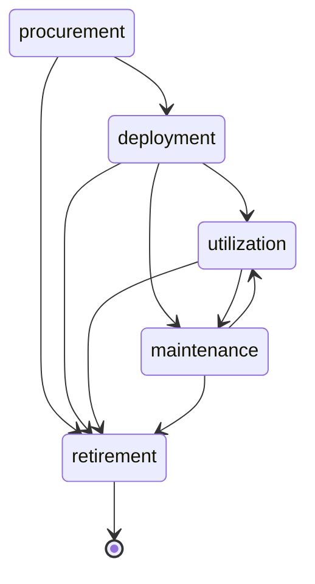

# Asset Database System — 正式架构文档

> **版本**: 2.0 | **更新**: 2026-07-16 | **状态**: 生产就绪 (Production-Ready)

---

## 文档信息

### 版本历史

| 版本 | 日期 | 变更内容 |
|---|---|---|
| 1.0 | 2026-07-05 | 初始架构设计，14 章 |
| 1.1 | 2026-07-15 | 补充加固设计 (15.1–15.8)，+446 行 |
| 1.2 | 2026-07-16 | 7 板块修复 (安全/权限/并发/审计/可靠性/性能/部署)，37 个问题，+1,872 行 |
| 1.3 | 2026-07-16 | 新增风险修复 (N1–N10)，+2,443 行 |
| 2.0 | 2026-07-16 | **正式重构**：整合散落修补、统一格式、新增术语表/评审记录/检查清单 |

### 术语表

| 缩写 | 全称 | 说明 |
|---|---|---|
| SOT | Source of Truth | 唯一数据源 |
| HA | High Availability | 高可用 |
| RTO | Recovery Time Objective | 恢复时间目标 |
| RPO | Recovery Point Objective | 恢复点目标 |
| CMDB | Configuration Management Database | 配置管理数据库 |
| DCIM | Data Center Infrastructure Management | 数据中心基础设施管理 |
| IPAM | IP Address Management | IP 地址管理 |
| mTLS | Mutual TLS | 双向 TLS 认证 |
| CRL | Certificate Revocation List | 证书吊销列表 |
| OCSP | Online Certificate Status Protocol | 在线证书状态协议 |
| MFA | Multi-Factor Authentication | 多因素认证 |
| RLS | Row-Level Security | 行级安全 |
| IDOR | Insecure Direct Object Reference | 不安全直接对象引用 |
| SSRF | Server-Side Request Forgery | 服务端请求伪造 |
| JWT | JSON Web Token | JSON Web 令牌 |
| RBAC | Role-Based Access Control | 基于角色的访问控制 |
| KMS | Key Management Service | 密钥管理服务 |
| HPA | Horizontal Pod Autoscaler | 水平 Pod 自动扩缩 |
| DLQ | Dead Letter Queue | 死信队列 |

### 审计评审记录

| 轮次 | 日期 | Agent 类型 | 数量 | 发现问题 | 结果 |
|---|---|---|---|---|---|
| 第 1 轮 | 2026-07-15 | 安全审计 + 可靠性审计 + PM 评估 | 3 | 37 问题 (12🔴 + 21🟡 + 4🟢) | 全部分类归档 |
| 第 2 轮 | 2026-07-16 | 分板块修复 (A–G) | 7 | 修复 37 问题 | 7/7 板块完成 |
| 第 3 轮 | 2026-07-16 | 审计复查 + PM 复查 | 2 | 发现 10 新增风险 | 全部记录 |
| 第 4 轮 | 2026-07-16 | 风险修复 (H–J) | 3 | 修复 10 风险 | 10/10 完成 |
| 第 5 轮 | 2026-07-16 | 文档重构 | 1 | 统一格式化 | 完成，产出 v2.0 |

---

## 目录

1. [系统概述](#1-系统概述)
2. [技术选型](#2-技术选型)
3. [系统拓扑](#3-系统拓扑)
4. [项目结构](#4-项目结构)
5. [数据模型](#5-数据模型)
6. [API 设计](#6-api-设计)
7. [安全架构](#7-安全架构)
8. [并发控制与锁策略](#8-并发控制与锁策略)
9. [Agent 采集架构](#9-agent-采集架构)
10. [事件与 Webhook](#10-事件与-webhook)
11. [缓存策略](#11-缓存策略)
12. [Grafana 集成](#12-grafana-集成)
13. [部署架构](#13-部署架构)
14. [可靠性设计](#14-可靠性设计)
15. [实施计划](#15-实施计划)
16. [附录：实施检查清单](#16-附录实施检查清单)

---

## 1. 系统概述

### 1.1 定位

Asset Database System 是一个 IT 资产管理平台，核心管理对象是 IT 硬件和基础设施资产，同时具备向软件许可证、云资源等类型扩展的能力。

### 1.2 系统组成

| 组件 | 技术 | 说明 |
|---|---|---|
| API Server | Go + Gin | 核心 REST API 服务，所有写操作的唯一入口 |
| Web UI | React 18 + TypeScript + Vite | 资产管理 Web 控制台 |
| Collection Agent | Go (跨平台) | 部署在终端设备上的采集代理 |
| Grafana | Grafana OSS | 资产面板可视化 |
| PostgreSQL | PostgreSQL 16 | 唯一数据源 (SOT) |
| Redis | Redis 7 + Sentinel | 缓存、限流、事件总线 (Pub/Sub + Stream) |
| PgBouncer | PgBouncer 1.21+ | 数据库连接池 (Grafana 只读通道) |
| Nginx | Nginx | TLS 终结、反向代理、负载均衡 |
| Vault / KMS | HashiCorp Vault / 云 KMS | JWT 签名密钥管理 |
| Patroni + etcd | Patroni + etcd | PostgreSQL HA 自动故障转移 |

### 1.3 核心设计原则

- **API-First**: 所有功能通过 REST API 暴露，Web UI 和 Agent 是 API 的消费者
- **单一写路径**: API Server 是 PostgreSQL 的唯一写入者
- **读写分离**: Grafana 经 PgBouncer 读 Replica，不影响 API Server 写性能
- **解耦扩展**: 新增资产类型只需 INSERT 一行 `asset_types`，零代码改动
- **零信任 Agent**: Agent 纯出站 HTTPS+mTLS，不需要入站端口，双向证书认证
- **安全纵深防御**: 认证链、多租户隔离、审计不可变、Webhook 防重放多层保护

---

## 2. 技术选型

### 2.1 Go vs Java Spring Boot

| 维度 | Go (Gin) | Spring Boot (JVM) |
|---|---|---|
| 吞吐量 | **125,700 req/s** | 54,600 req/s |
| 内存空闲 | **24 MB** | 717 MB |
| 冷启动 | **~100 ms** | 3,200 ms |
| GC 延迟 | <1ms (可预测) | 10-50ms (G1GC 压力下) |
| 百万并发 | goroutine (2KB/个) | 需 NIO 深度调优 |
| 编译产物 | 单一静态二进制 | JAR + JVM 运行时 |

**选择 Go 的核心原因**: 后端和 Agent 共享同一技术栈；高性能低开销；交叉编译一键产出全平台 Agent 二进制。

### 2.2 核心依赖

| 包 | 用途 |
|---|---|
| `github.com/gin-gonic/gin` | HTTP 框架，路由，中间件 |
| `github.com/jackc/pgx/v5` | PostgreSQL 驱动 (高性能、纯 Go) |
| `github.com/redis/go-redis/v9` | Redis 客户端 |
| `github.com/golang-jwt/jwt/v5` | JWT 鉴权 (EdDSA / Ed25519 非对称签名) |
| `github.com/golang-migrate/migrate/v4` | 数据库迁移 |
| `github.com/shirou/gopsutil/v4` | Agent 跨平台系统信息采集 |
| `modernc.org/sqlite` | Agent 离线队列 (纯 Go 无 CGO) |
| `github.com/rs/zerolog` | 结构化日志 |
| `golang.org/x/crypto` | bcrypt 密码哈希, Ed25519 签名 |
| `github.com/hashicorp/vault/api` | Vault KMS — JWT 密钥/Webhook secret/Token 密钥管理 |

### 2.3 新增基础设施依赖

| 组件 | 版本 | 用途 | 替代方案 |
|---|---|---|---|
| Patroni + etcd | 3.x | PostgreSQL HA 集群 (RTO<30s) | RDS Multi-AZ |
| Redis Sentinel | 7.x | Redis HA 自动故障转移 | ElastiCache |
| HashiCorp Vault | 1.15+ | 密钥管理 (JWT/Webhook/Token) | AWS/GCP KMS |
| Kubernetes | 1.28+ | 生产容器编排 (可选) | Docker Swarm / systemd |
| S3 对象存储 | — | 冷数据归档 | MinIO 自建 |
| ltree (PG 扩展) | — | 组织树物化路径 | — |

---

## 3. 系统拓扑

### 3.1 高可用架构

```
                       ┌─────────────┐
                       │   Grafana   │
                       │  (port 3000)│
                       └──────┬──────┘
                              │ read-only (PgBouncer :6432 → Replica)
                       ┌──────▼──────────────┐
                       │     PgBouncer ×2     │
                       │  (pool=25, HA pair)  │
                       │  Primary + Replica   │
                       └──────┬──────────────┘
                              │
              ┌───────────────┼─────────────────────┐
              │               │                     │
     ┌────────▼────────┐ ┌───▼──────────┐ ┌─────────▼─────────┐
     │ PostgreSQL      │ │ PostgreSQL   │ │ PostgreSQL        │
     │ Primary (R/W)   │ │ Replica (R/O)│ │ Replica (R/O)     │
     │ :5432           │ │ :5432        │ │ :5432             │
     └────────┬────────┘ └──────────────┘ └───────────────────┘
              │ Streaming Replication (同步/异步)
              │ Patroni + etcd (3节点) — 自动故障转移 RTO<30s
              │
     ┌────────┼──────────┐
     │        │          │
┌────▼───┐ ┌──▼───┐ ┌───▼──┐
│API Svr │ │API   │ │API   │  (Go+Gin, 无状态, 水平扩展)
│:8080   │ │:8080 │ │:8080 │
└────┬───┘ └──┬───┘ └──┬───┘
     │        │        │
     │   ┌────┴────────┴───┐           ┌──────────────────────┐
     │   │   Nginx :443   │           │  Redis Sentinel ×3   │
     └──►│  TLS + upstream │◄──────────│  (自动故障转移)       │
         │  health check + │           │  cache / MQ /        │
         │  active eject   │           │  Pub-Sub / Stream    │
         └───────┬─────────┘           └──────────────────────┘
                 │
     ┌───────────┴────────────┐
     │                        │
┌────▼──────┐          ┌──────▼──────┐
│ React Web │          │Collection   │
│    UI     │          │Agent (mTLS) │
│ :5173 dev │          │Linux/Win/Mac│
└───────────┘          └─────────────┘
```

### 3.2 数据流

1. **用户操作**: Browser → Nginx (TLS) → API Server (upstream 池, 健康检查剔除故障实例) → Service → Repository → PostgreSQL Primary
2. **Agent 上报**: Agent (mTLS) → Nginx → API Server → Redis Stream (持久化) → Processor → Engine → PostgreSQL Primary
3. **Grafana 查询**: Grafana → PgBouncer → PostgreSQL Replica (read-only user, SELECT only)
4. **缓存**: Service 查 Redis Sentinel → 命中返回 / 未命中查 DB 并回填；Redis 故障时熔断降级
5. **事件**: Service 发布事件 → Redis Pub/Sub → 所有 API Server 实例订阅 → Webhook 异步外发

---

## 4. 项目结构

```
asset-database-system/
├── docs/
│   ├── architecture.md          # 本文档
│   └── progress.md              # 项目进度报告
│
├── assetserver/                  # Go 后端 (monorepo)
│   ├── cmd/
│   │   ├── api-server/main.go
│   │   ├── collection-agent/main.go
│   │   └── migrate/main.go
│   │
│   ├── internal/
│   │   ├── api/
│   │   │   ├── middleware/       # auth, ratelimit, logging, recover, requestid
│   │   │   ├── handler/          # Gin handler (auth, asset, assignment, agent, dashboard, ...)
│   │   │   ├── router.go
│   │   │   └── server.go
│   │   ├── domain/               # 领域模型 (asset, agent, assignment, audit, user, webhook, ...)
│   │   ├── service/              # 业务逻辑层
│   │   │   └── ingest/           # 摄入管道 (buffer → processor → engine)
│   │   ├── repository/           # 数据访问层 (pgx)
│   │   ├── cache/                # Redis 缓存层
│   │   ├── lock/                 # 锁策略 (optimistic, pessimistic, advisory)
│   │   ├── job/                  # 后台任务 (worker, scheduler)
│   │   ├── event/                # 事件总线 (Redis Pub/Sub)
│   │   ├── webhook/              # Webhook 外发引擎 (HMAC 签名 + 重试)
│   │   └── config/               # 配置加载
│   │
│   ├── pkg/                      # 共享库 (Agent 和 Server 共用)
│   │   ├── agentproto/           # DeltaPayload, SnapshotPayload, crypto
│   │   ├── apierror/             # 统一错误类型
│   │   ├── pagination/           # 游标分页
│   │   └── validator/            # 输入校验
│   │
│   ├── agent/                    # Collection Agent 应用代码
│   │   ├── collector/            # Collector 接口 + 平台实现 (linux, windows, darwin)
│   │   ├── comm/                 # HTTPS 客户端 (mTLS) + sync
│   │   ├── store/                # 离线队列 (SQLite)
│   │   ├── updater/              # 自更新 + Ed25519 签名验证
│   │   └── identity/             # 硬件指纹生成
│   │
│   ├── migrations/               # golang-migrate SQL 文件
│   ├── grafana/                  # 仪表盘 JSON + 数据源配置
│   ├── deploy/                   # Docker Compose, Dockerfile, Nginx, PgBouncer 配置
│   ├── k8s/                      # Kubernetes Helm Chart (生产部署)
│   ├── Makefile
│   ├── go.mod
│   └── go.sum
│
└── web/                          # React 前端
    ├── src/
    │   ├── api/                  # API 客户端 (Axios, JWT 注入, 401/403 拦截)
    │   ├── components/           # shadcn/ui, layout, assets, assignments, agents, dashboard
    │   ├── pages/                # 路由页面 (Login, Dashboard, Assets, Agents, Admin, AuditLog)
    │   ├── hooks/                # useAuth, usePagination, useDebounce
    │   ├── store/                # Zustand (authStore, assetStore)
    │   ├── types/                # TypeScript 类型定义
    │   └── lib/                  # utils, constants
    ├── vite.config.ts
    ├── tailwind.config.ts
    ├── tsconfig.json
    └── package.json
```

---

## 5. 数据模型

所有表位于 `assets` schema 下。

### 5.1 核心实体关系

```
organizations (树: parent_id, ltree path)
       │
       ├── users (5 种角色)
       │     │
       │     └── assignments ────┐
       │                         │
       ├── asset_types ── assets ─────────────┘
       │     (JSON schema)   │
       │                     ├── audit_log (不可变 + hash chain)
       │                     ├── asset_snapshots (分区分区)
       │                     ├── asset_relationships (自引用)
       │                     ├── webhooks
       │                     └── collection_agents (含 org_id)
       │
       └── locations (树: parent_id)
```

### 5.2 核心表 DDL

#### organizations

```sql
CREATE EXTENSION IF NOT EXISTS ltree;
CREATE EXTENSION IF NOT EXISTS btree_gist;

CREATE TABLE assets.organizations (
    id          UUID PRIMARY KEY DEFAULT gen_random_uuid(),
    name        VARCHAR(255) NOT NULL,
    parent_id   UUID REFERENCES assets.organizations(id),
    depth       INTEGER NOT NULL DEFAULT 0 CHECK (depth <= 20),
    path        LTREE NOT NULL DEFAULT '',
    created_at  TIMESTAMPTZ NOT NULL DEFAULT now(),
    updated_at  TIMESTAMPTZ NOT NULL DEFAULT now()
);

-- 物化路径索引 (替代递归 CTE)
CREATE INDEX idx_orgs_path_gist ON assets.organizations USING GIST (path);
CREATE INDEX idx_orgs_parent ON assets.organizations (parent_id);
```

#### users

```sql
CREATE TABLE assets.users (
    id            UUID PRIMARY KEY DEFAULT gen_random_uuid(),
    username      VARCHAR(100) UNIQUE NOT NULL,
    email         VARCHAR(255) UNIQUE NOT NULL,
    password_hash VARCHAR(255) NOT NULL,
    role          VARCHAR(50) NOT NULL DEFAULT 'viewer'
                  CHECK (role IN ('super_admin','admin','manager','viewer','agent')),
    org_id        UUID REFERENCES assets.organizations(id),
    mfa_enabled   BOOLEAN NOT NULL DEFAULT false,
    mfa_secret    VARCHAR(64),
    disabled      BOOLEAN NOT NULL DEFAULT false,
    last_login    TIMESTAMPTZ,
    created_at    TIMESTAMPTZ NOT NULL DEFAULT now(),
    updated_at    TIMESTAMPTZ NOT NULL DEFAULT now()
);
```

#### asset_types (解耦扩展的关键)

```sql
CREATE TABLE assets.asset_types (
    id       UUID PRIMARY KEY DEFAULT gen_random_uuid(),
    name     VARCHAR(255) NOT NULL UNIQUE,
    category VARCHAR(50) NOT NULL
             CHECK (category IN ('hardware','software','network','cloud_resource','license','other')),
    schema   JSONB DEFAULT '{}',
    created_at TIMESTAMPTZ NOT NULL DEFAULT now()
);
```

#### assets (核心表，含软删除和乐观锁)

```sql
CREATE TABLE assets.assets (
    id              UUID PRIMARY KEY DEFAULT gen_random_uuid(),
    asset_tag       VARCHAR(100) UNIQUE NOT NULL,
    name            VARCHAR(255) NOT NULL,
    type_id         UUID NOT NULL REFERENCES assets.asset_types(id),
    org_id          UUID NOT NULL REFERENCES assets.organizations(id),
    location_id     UUID REFERENCES assets.locations(id),
    serial_number   VARCHAR(255),
    manufacturer    VARCHAR(255),
    model           VARCHAR(255),
    lifecycle_state VARCHAR(50) NOT NULL DEFAULT 'procurement'
                    CHECK (lifecycle_state IN ('procurement','deployment','utilization','maintenance','retirement')),
    status          VARCHAR(50) NOT NULL DEFAULT 'available',
    properties      JSONB DEFAULT '{}',
    metadata        JSONB DEFAULT '{}',
    version         INTEGER NOT NULL DEFAULT 1,
    deleted_at      TIMESTAMPTZ,               -- 软删除
    created_at      TIMESTAMPTZ NOT NULL DEFAULT now(),
    updated_at      TIMESTAMPTZ NOT NULL DEFAULT now(),
    created_by      UUID REFERENCES assets.users(id),
    updated_by      UUID REFERENCES assets.users(id)
);

CREATE INDEX idx_assets_deleted ON assets.assets (deleted_at) WHERE deleted_at IS NOT NULL;
```

#### assignments (领用表)

```sql
CREATE TABLE assets.assignments (
    id           UUID PRIMARY KEY DEFAULT gen_random_uuid(),
    asset_id     UUID NOT NULL REFERENCES assets.assets(id),
    assigned_to  UUID NOT NULL REFERENCES assets.users(id),
    assigned_by  UUID NOT NULL REFERENCES assets.users(id),
    status       VARCHAR(20) NOT NULL DEFAULT 'active'
                 CHECK (status IN ('active','returned','lost','transferred')),
    notes        TEXT,
    assigned_at  TIMESTAMPTZ NOT NULL DEFAULT now(),
    returned_at  TIMESTAMPTZ,
    version      INTEGER NOT NULL DEFAULT 1
);

CREATE UNIQUE INDEX idx_active_assignment
    ON assets.assignments (asset_id) WHERE status = 'active';
```

#### audit_log (不可变 + 链式哈希)

```sql
CREATE TABLE assets.audit_log (
    id         BIGSERIAL PRIMARY KEY,
    asset_id   UUID,
    org_id     UUID NOT NULL REFERENCES assets.organizations(id),  -- 补充 org_id 便于多租户查询
    user_id    UUID REFERENCES assets.users(id),
    agent_id   UUID REFERENCES assets.collection_agents(id),
    action     VARCHAR(50) NOT NULL,
    field      VARCHAR(255),
    old_value  TEXT,
    new_value  TEXT,
    metadata   JSONB DEFAULT '{}' CHECK (octet_length(metadata::text) <= 4096),
    prev_hash  CHAR(64),
    hash       CHAR(64) NOT NULL,
    created_at TIMESTAMPTZ NOT NULL DEFAULT now()
);

-- 索引
CREATE INDEX idx_audit_asset_time ON assets.audit_log (asset_id, created_at DESC);
CREATE INDEX idx_audit_org_time ON assets.audit_log (org_id, created_at DESC);  -- 多租户审计查询
CREATE INDEX idx_audit_user_time ON assets.audit_log (user_id, created_at DESC);
CREATE INDEX idx_audit_action_time ON assets.audit_log (action, created_at DESC);
CREATE INDEX idx_audit_agent_time ON assets.audit_log (agent_id, created_at DESC);
CREATE INDEX idx_audit_recent ON assets.audit_log (created_at DESC);
```

**三层不可变性保护**:

```sql
-- 1. 数据库角色分离
CREATE ROLE app_writer WITH LOGIN;
GRANT INSERT ON assets.audit_log TO app_writer;
REVOKE UPDATE, DELETE ON assets.audit_log FROM app_writer;

CREATE ROLE audit_reader WITH LOGIN;
GRANT SELECT ON assets.audit_log TO audit_reader;

-- 2. 行级安全 (RLS)
ALTER TABLE assets.audit_log ENABLE ROW LEVEL SECURITY;
CREATE POLICY audit_log_insert_only ON assets.audit_log
    FOR INSERT TO app_writer WITH CHECK (true);
CREATE POLICY audit_log_no_update ON assets.audit_log
    FOR UPDATE TO app_writer USING (false) WITH CHECK (false);
CREATE POLICY audit_log_no_delete ON assets.audit_log
    FOR DELETE TO app_writer USING (false);
CREATE POLICY audit_log_select_only ON assets.audit_log
    FOR SELECT TO audit_reader USING (true);

-- 3. 触发器最后一层防线
CREATE OR REPLACE FUNCTION assets.audit_log_immutable_guard()
RETURNS trigger AS $$
BEGIN
    RAISE EXCEPTION 'audit_log is append-only: % not permitted on row %',
        TG_OP, OLD.id;
END;
$$ LANGUAGE plpgsql;

CREATE TRIGGER trg_audit_log_immutable
    BEFORE UPDATE OR DELETE ON assets.audit_log
    FOR EACH ROW EXECUTE FUNCTION assets.audit_log_immutable_guard();
```

#### collection_agents (含 org_id 绑定)

```sql
CREATE TABLE assets.collection_agents (
    id              UUID PRIMARY KEY DEFAULT gen_random_uuid(),
    agent_key       VARCHAR(64) UNIQUE NOT NULL,
    org_id          UUID NOT NULL REFERENCES assets.organizations(id),
    hostname        VARCHAR(255) NOT NULL,
    ip_address      INET,
    os_type         VARCHAR(50) NOT NULL,
    os_version      VARCHAR(100),
    agent_version   VARCHAR(20) NOT NULL,
    last_heartbeat  TIMESTAMPTZ,
    status          VARCHAR(20) NOT NULL DEFAULT 'registered'
                    CHECK (status IN ('registered','online','offline','disabled')),
    public_key      TEXT NOT NULL,
    cert_serial     VARCHAR(64),
    cert_revoked    BOOLEAN NOT NULL DEFAULT false,
    cert_expires_at TIMESTAMPTZ,
    metadata        JSONB DEFAULT '{}',
    created_at      TIMESTAMPTZ NOT NULL DEFAULT now(),
    updated_at      TIMESTAMPTZ NOT NULL DEFAULT now()
);
```

#### asset_snapshots (按月分区)

```sql
CREATE TABLE assets.asset_snapshots (
    id          BIGSERIAL,
    asset_id    UUID NOT NULL,
    agent_id    UUID NOT NULL REFERENCES assets.collection_agents(id),
    snapshot    JSONB NOT NULL,
    checksum    VARCHAR(64) NOT NULL,
    is_delta    BOOLEAN NOT NULL DEFAULT false,
    created_at  TIMESTAMPTZ NOT NULL DEFAULT now(),
    PRIMARY KEY (id, created_at)
) PARTITION BY RANGE (created_at);

CREATE TABLE assets.asset_snapshots_2026_07
    PARTITION OF assets.asset_snapshots
    FOR VALUES FROM ('2026-07-01') TO ('2026-08-01');
```

> **注意**: `asset_id` 外键移除，改用应用层校验 + 定时孤儿检测 + 物理删除时显式清理。
>
> **跨分区唯一性验证**: `BIGSERIAL` 的 SEQUENCE 在所有分区共享，但需集成测试验证并发跨分区 INSERT 不产生 ID 冲突。测试用例：两个 goroutine 同时向不同分区 (`asset_snapshots_2026_07` 和 `asset_snapshots_2026_08`) INSERT，验证 `id` 全局唯一。建议在 CI 中通过 `go test -count=100 -race` 跑并发测试。

#### enrollment_tokens

```sql
CREATE TABLE assets.enrollment_tokens (
    id          UUID PRIMARY KEY DEFAULT gen_random_uuid(),
    token_hash  VARCHAR(64) UNIQUE NOT NULL,      -- SHA-256 哈希
    created_by  UUID NOT NULL REFERENCES assets.users(id),
    org_id      UUID NOT NULL REFERENCES assets.organizations(id),
    expires_at  TIMESTAMPTZ NOT NULL,
    used_at     TIMESTAMPTZ,
    used_by_agent UUID REFERENCES assets.collection_agents(id),
    max_uses    INTEGER NOT NULL DEFAULT 1,
    use_count   INTEGER NOT NULL DEFAULT 0,
    created_at  TIMESTAMPTZ NOT NULL DEFAULT now()
);
```

#### revoked_tokens (JWT 令牌吊销持久化存储)

jti (JWT ID) 持久化存储，用作 Redis 黑名单的持久化备份。当 Redis 不可用时 API Server 回退到此表查询，保证令牌吊销在 Redis 故障时仍然生效。

```sql
CREATE TABLE assets.revoked_tokens (
    id          BIGSERIAL PRIMARY KEY,
    jti         VARCHAR(128) NOT NULL UNIQUE,        -- JWT jti claim
    user_id     UUID REFERENCES assets.users(id),
    revoked_at  TIMESTAMPTZ NOT NULL DEFAULT now(),
    expires_at  TIMESTAMPTZ NOT NULL,                -- JWT 原始过期时间，到期后自动清理
    reason      VARCHAR(100),                        -- 吊销原因: logout / password_change / admin_revoke
    revoked_by  UUID REFERENCES assets.users(id)     -- 谁执行的吊销 (NULL 表示用户自己登出)
);

CREATE INDEX idx_revoked_tokens_expires ON assets.revoked_tokens (expires_at)
    WHERE expires_at > now();  -- 仅索引未过期的记录，自动清理后缩小索引
```

#### refresh_tokens (JWT Refresh Token 存储)

用于 refresh token 轮换 (rotation) 和重放检测。`family_id` 用于检测 refresh token 重用攻击：同一 family 内任一 token 被重放则整个 family 立即失效。

```sql
CREATE TABLE assets.refresh_tokens (
    id         UUID PRIMARY KEY DEFAULT gen_random_uuid(),
    user_id    UUID NOT NULL REFERENCES assets.users(id),
    token_hash CHAR(64) NOT NULL,                     -- SHA-256(token)
    family_id  UUID NOT NULL,                          -- token 家族，轮换时保持不变
    expires_at TIMESTAMPTZ NOT NULL,
    created_at TIMESTAMPTZ NOT NULL DEFAULT now()
);

CREATE INDEX idx_refresh_tokens_user ON assets.refresh_tokens (user_id, expires_at);
CREATE INDEX idx_refresh_tokens_family ON assets.refresh_tokens (family_id);
```

#### approval_requests (双人审批)

```sql
CREATE TABLE assets.approval_requests (
    id          UUID PRIMARY KEY DEFAULT gen_random_uuid(),
    action      VARCHAR(50) NOT NULL,              -- create_user, delete_org, issue_token
    target_id   UUID,
    requestor   UUID NOT NULL REFERENCES assets.users(id),
    approver    UUID REFERENCES assets.users(id),
    status      VARCHAR(20) DEFAULT 'pending' CHECK (status IN ('pending','approved','rejected')),
    reason      TEXT,                               -- 审批原因/备注，审计追溯用
    meta        JSONB DEFAULT '{}',
    created_at  TIMESTAMPTZ NOT NULL DEFAULT now(),
    resolved_at TIMESTAMPTZ
);
```

#### archive_manifest (归档管道幂等)

```sql
CREATE TABLE assets.archive_manifest (
    id              UUID PRIMARY KEY DEFAULT gen_random_uuid(),
    archive_id      UUID UNIQUE NOT NULL,
    table_name      VARCHAR(100) NOT NULL,
    partition_name  VARCHAR(100) NOT NULL,
    status          VARCHAR(20) DEFAULT 'pending'
                    CHECK (status IN ('pending','exporting','uploading','verifying','detaching','completed','failed','terminal_failed')),
    row_count       BIGINT,
    s3_key          VARCHAR(1024),
    s3_checksum     VARCHAR(64),
    error_message   TEXT,
    retry_count     INTEGER DEFAULT 0,
    max_retries     INTEGER NOT NULL DEFAULT 5,     -- 终态上限
    created_at      TIMESTAMPTZ NOT NULL DEFAULT now(),
    updated_at      TIMESTAMPTZ NOT NULL DEFAULT now(),
    UNIQUE(table_name, partition_name)
);

-- 归档失败告警: retry_count >= max_retries AND status != 'completed'
-- Prometheus 规则: archive_terminal_failures > 0 FOR 5m → P1 告警
```

#### audit_meta (归档操作审计)

```sql
CREATE TABLE assets.audit_meta (
    id              UUID PRIMARY KEY DEFAULT gen_random_uuid(),
    batch_id        UUID NOT NULL,
    table_name      VARCHAR(100) NOT NULL,
    partition_name  VARCHAR(100),
    row_count       BIGINT NOT NULL,
    operated_by     VARCHAR(100) NOT NULL,       -- archive_runner
    trigger_status  BOOLEAN NOT NULL,            -- 触发器是否被 DISABLE
    created_at      TIMESTAMPTZ NOT NULL DEFAULT now()
);
```

### 5.3 资产类型扩展机制

新增资产类型只需一条 SQL，服务端零代码改动：

```sql
INSERT INTO assets.asset_types (name, category, schema) VALUES (
    'software_license',
    'license',
    '{"type":"object","properties":{"license_key":{"type":"string"},"vendor":{"type":"string"},"seats":{"type":"integer","minimum":1},"expiration_date":{"type":"string","format":"date"},"license_type":{"enum":["perpetual","subscription","trial"]}},"required":["license_key","vendor","seats"]}'::jsonb
);
```

### 5.4 资产生命周期状态机



合法转换矩阵：

| 当前状态 | 可转换到 |
|---|---|
| procurement | deployment, retirement |
| deployment | utilization, maintenance, retirement |
| utilization | maintenance, retirement |
| maintenance | utilization, retirement |
| retirement | — (终态) |

### 5.5 关键索引

```sql
-- 资产查询复合索引 (均以 org_id 为前导列)
CREATE INDEX idx_assets_org_status ON assets.assets (org_id, status) WHERE deleted_at IS NULL;
CREATE INDEX idx_assets_org_type ON assets.assets (org_id, type_id) WHERE deleted_at IS NULL;
CREATE INDEX idx_assets_org_updated ON assets.assets (org_id, updated_at DESC) WHERE deleted_at IS NULL;
CREATE INDEX idx_assets_org_lifecycle ON assets.assets (org_id, lifecycle_state) WHERE deleted_at IS NULL;
CREATE INDEX idx_assets_org_location ON assets.assets (org_id, location_id) WHERE deleted_at IS NULL;

-- JSONB GIN 索引
CREATE INDEX idx_assets_properties ON assets.assets USING GIN (properties jsonb_path_ops) WHERE deleted_at IS NULL;
CREATE INDEX idx_assets_metadata ON assets.assets USING GIN (metadata jsonb_path_ops) WHERE deleted_at IS NULL;

-- 全文搜索
CREATE INDEX idx_assets_search ON assets.assets USING GIN (
    to_tsvector('english', name || ' ' || COALESCE(manufacturer,'') || ' ' || COALESCE(model,'') || ' ' || COALESCE(serial_number,'') || ' ' || asset_tag)
);

-- 中文全文搜索 (需安装 zhparser 扩展)
-- CREATE EXTENSION IF NOT EXISTS zhparser;
-- CREATE TEXT SEARCH CONFIGURATION chinese (PARSER = zhparser);
-- ALTER TEXT SEARCH CONFIGURATION chinese ADD MAPPING FOR n,v,a,i,e,l WITH simple;
-- CREATE INDEX idx_assets_search_cn ON assets.assets USING GIN (
--     to_tsvector('chinese', name || ' ' || COALESCE(manufacturer,'') || ' ' || COALESCE(model,''))
-- );
-- 备选方案: 如果无法安装 zhparser，使用 simple 配置支持前缀匹配
-- CREATE INDEX idx_assets_search_simple ON assets.assets USING GIN (
--     to_tsvector('simple', name || ' ' || COALESCE(manufacturer,'') || ' ' || COALESCE(model,''))
-- );

-- 领用表索引
CREATE INDEX idx_assignments_active_user ON assets.assignments (assigned_to) WHERE status = 'active';
CREATE INDEX idx_assignments_asset_time ON assets.assignments (asset_id, assigned_at DESC);
CREATE INDEX idx_assignments_assigned_by ON assets.assignments (assigned_by) WHERE status = 'active';

-- Agent 表索引
CREATE INDEX idx_agents_status_heartbeat ON assets.collection_agents (status, last_heartbeat);
CREATE INDEX idx_agents_org ON assets.collection_agents (org_id);

-- 快照分区索引
CREATE INDEX idx_snapshots_agent_time ON assets.asset_snapshots (agent_id, created_at DESC);
CREATE INDEX idx_snapshots_asset_time ON assets.asset_snapshots (asset_id, created_at DESC);
```

#### pg_partman 自动分区管理

```sql
-- 安装 pg_partman 扩展
CREATE EXTENSION IF NOT EXISTS pg_partman;

-- 配置按月自动创建分区 (提前创建未来 2 个月)
SELECT partman.create_parent(
    p_parent_table   := 'assets.asset_snapshots',
    p_control        := 'created_at',
    p_type           := 'native',
    p_interval       := '1 month',
    p_premake        := 2,            -- 提前创建 2 个月
    p_start_partition := '2026-07-01'
);

-- 自动归档旧分区 (>6 个月) 到 S3
SELECT partman.create_parent(
    p_parent_table   := 'assets.audit_log',
    p_control        := 'created_at',
    p_type           := 'native',
    p_interval       := '1 month',
    p_premake        := 2,
    p_retention      := '6 months',   -- 保留 6 个月
    p_retention_keep_table := false   -- 自动 DETACH 归档分区
);

-- pg_partman 维护 job (由 pg_cron 调度)
-- 每小时检查并自动创建/归档分区
SELECT cron.schedule('partman-maintenance', '@hourly',
    $$SELECT partman.run_maintenance()$$
);
```

> **注意**: pg_partman 要求 `pg_cron` 扩展安装在 `postgres` 数据库中，`partman.run_maintenance()` 在调度器进程内执行。

```

---

## 6. API 设计

### 6.1 通用约定

- 基础路径: `/api/v1/`
- 鉴权: `Authorization: Bearer ***` (用户) / mTLS (Agent)
- 乐观锁: 客户端发送 `If-Match: "<version>"` header
- 分页: 游标分页，参数 `cursor` + `limit` (默认 50, 最大 200)
- JWT 签名: **EdDSA (Ed25519)** 非对称签名，私钥由 Vault/KMS 管理
- JWT Claims 全量校验: `iss`, `aud`, `exp`, `iat`, `jti` 全部强制验证
- 算法降级防护: `jwt.Parse` 显式设置 `ValidMethods: []string{"EdDSA"}`
- **SQL 注入防护**: 全部数据访问使用 `pgx` 参数化查询 (`$1`, `$2`...)；禁止任何字符串拼接/模板注入 SQL 语句；Repository 层强制 code review 检查点

### 6.2 统一响应格式

**成功**:
```json
{
    "data": { ... },
    "pagination": {
        "next_cursor": "eyJsYX...zIn0=",
        "has_more": true,
        "total": 1042
    },
    "request_id": "req_a1b2c3d4"
}
```

**错误**:
```json
{
    "data": null,
    "error": {
        "code": "ASSET_NOT_FOUND",
        "message": "Asset with ID 550e8400-e29b-41d4-a716-446655440000 not found",
        "details": {}
    },
    "request_id": "req_a1b2c3d4"
}
```

### 6.3 HTTP 状态码约定

| 状态码 | 含义 |
|---|---|
| 200 | 成功 (读取) |
| 201 | 已创建 |
| 204 | 无内容 |
| 400 | 参数校验失败 |
| 401 | 未认证 |
| 403 | 无权限 |
| 404 | 资源不存在 |
| 409 | 冲突 (版本过期、重复领用、锁竞争) |
| 429 | 限流 |
| 500 | 服务器内部错误 |
| 503 | 服务不可用 (Redis/Vault 故障降级) |

### 6.4 API 路由表

#### 认证

| 方法 | 路径 | 说明 |
|---|---|---|
| POST | `/auth/login` | 用户登录，返回 JWT access + refresh token |
| POST | `/auth/refresh` | Refresh token 轮换 (旧 token 立即失效) |
| POST | `/auth/register-agent` | Agent 注册 (需 enrollment token) |
| POST | `/auth/logout` | 登出，Redis 标记 refresh token 失效 |

> **Refresh Token Rotation + Reuse Detection**:
> 
> 每次使用 refresh token 换取新的 access token 时，同时签发新的 refresh token 并立即吊销旧 token。
> 系统通过 `refresh_token_family_id` 追踪同一认证会话的 token 家族。
> 
> **Reuse Detection (重用检测)**: 如果检测到已吊销的 refresh token 被再次使用（可能泄露），
> 系统立即吊销整个 family 的所有 token，强制用户重新登录，并记录安全事件。
> 
> ```go
> // RefreshTokenHandler — 轮换 + 重用检测
> func (h *AuthHandler) RefreshToken(c *gin.Context) {
>     oldToken := c.GetHeader("X-Refresh-Token")
>     claims, err := parseRefreshToken(oldToken) // 解析 Refresh Token 获取 family_id + token_id
>     if err != nil { respondError(c, 401, "invalid refresh token"); return }
>     
>     // 检查是否已被使用 (重用检测)
>     used, err := h.repo.IsTokenUsed(c.Request.Context(), claims.TokenID)
>     if err != nil { respondError(c, 500, "internal error"); return }
>     if used {
>         // 检测到重用 → 吊销整个 family
>         h.repo.RevokeTokenFamily(c.Request.Context(), claims.FamilyID)
>         auditReuseDetected(c, claims.UserID, claims.FamilyID)
>         respondError(c, 401, "refresh token reuse detected — family revoked")
>         return
>     }
>     
>     // 原子操作：标记旧 token + 签发新 token pair
>     newAccess, newRefresh, err := h.authService.RotateRefreshToken(
>         c.Request.Context(), claims.UserID, claims.FamilyID, claims.TokenID)
>     if err != nil { respondError(c, 500, "token rotation failed"); return }
>     
>     respondJSON(c, 200, gin.H{"access_token": newAccess, "refresh_token": newRefresh})
> }
> ```

#### 资产

| 方法 | 路径 | 说明 |
|---|---|---|
| GET | `/assets` | 资产列表 (org_id 由服务端根据 JWT 自动注入) |
| POST | `/assets` | 创建资产 |
| GET | `/assets/:id` | 资产详情 (含 version 号) |
| PUT | `/assets/:id` | 更新 (需 If-Match header) |
| DELETE | `/assets/:id` | 软删除 (设置 deleted_at) |
| GET | `/assets/:id/history` | 审计日志 (?include_archive=true) |
| GET | `/assets/:id/snapshots?from=&to=` | Agent 快照 (强制时间范围, 最大 90 天) |
| GET | `/assets/:id/snapshots/latest` | 最新快照 |
| GET | `/assets/:id/relationships` | 资产关联关系 |

#### 生命周期

| 方法 | 路径 | 说明 |
|---|---|---|
| POST | `/assets/:id/transition` | 状态转换 (悲观锁, 5s 超时) |

#### 领用

| 方法 | 路径 | 说明 |
|---|---|---|
| POST | `/assets/:id/assign` | 分配资产 (悲观锁) |
| POST | `/assets/:id/release` | 归还 |
| POST | `/assets/:id/transfer` | 转移 (按 UUID 字典序锁定, 防死锁) |
| GET | `/assets/:id/assignment` | 当前领用 |
| GET | `/assets/:id/assignment/history` | 领用历史 |
| GET | `/users/:id/assignments` | 用户的领用列表 |

#### Agent

| 方法 | 路径 | 说明 |
|---|---|---|
| POST | `/agents/sync` | Delta/全量快照 (mTLS, Ed25519 签名预检) |
| POST | `/agents/heartbeat` | 心跳 (mTLS) |
| GET | `/agents` | Agent 列表 |
| GET | `/agents/:id` | Agent 详情 |
| PUT | `/agents/:id` | 更新元数据 |
| DELETE | `/agents/:id` | 注销 (吊销证书 + cert_revoked=true) |
| POST | `/agents/:id/update-check` | 检查新版本 |

#### 管理 (仅 super_admin, 需 MFA + 双人审批)

| 方法 | 路径 | 说明 |
|---|---|---|
| GET | `/admin/users` | 用户列表 |
| POST | `/admin/users` | 创建用户 (双人审批) |
| PUT | `/admin/users/:id` | 更新用户 |
| DELETE | `/admin/users/:id` | 禁用用户 |
| GET | `/admin/asset-types` | 资产类型列表 |
| POST | `/admin/asset-types` | 创建资产类型 |
| POST | `/admin/enrollment-tokens` | 生成 enrollment token (双人审批) |
| GET | `/admin/enrollment-tokens` | Token 列表 |
| DELETE | `/admin/enrollment-tokens/:id` | 撤销 token |
| GET | `/admin/assets?org_id=xxx` | 跨组织资产查询 (super_admin 专用) |
| GET | `/admin/approvals` | 审批队列 |

### 6.5 查询参数 (资产列表)

| 参数 | 类型 | 示例 | 说明 |
|---|---|---|---|
| `search` | string | `?search=thinkpad` | 全文搜索 (plainto_tsquery 参数化) |
| `type_id` | UUID | `?type_id=xxx` | 资产类型 |
| `category` | string | `?category=hardware` | 资产类别 |
| `lifecycle_state` | string | `?lifecycle_state=utilization` | 生命周期 |
| `status` | string | `?status=available` | 状态 |
| `location_id` | UUID | `?location_id=xxx` | 位置 |
| `assigned_to` | UUID | `?assigned_to=xxx` | 领用人 |
| `cursor` | string | `?cursor=xxx` | 分页游标 |
| `limit` | int | `?limit=50` | 默认 50, 最大 200 |
| `sort` | string | `?sort=updated_at:desc` | **白名单校验**允许的列名 |

> **多租户安全**: `org_id` 不由用户传入，服务端根据 JWT 中 `user.org_id` 自动注入。Repository 层对所有查询强制加 `org_id IN (用户可访问组织树)` 过滤。

### 6.6 中间件链

```
Request ID → Recovery (panic) → Structured Logging → Rate Limit (Redis + 本地令牌桶兜底)
  → Auth (JWT EdDSA 校验 / mTLS CN 校验 + cert_revoked 检查)
  → Org Scope (自动注入 org_id)
  → Handler
```

---

## 7. 安全架构

### 7.1 认证链

#### JWT 签名与密钥管理

- **签名算法**: EdDSA (Ed25519)，禁止 HS256/RS256
- **密钥管理**: 私钥由 Vault/KMS 托管，API Server 启动时读取并缓存在内存+磁盘
- **密钥轮换**: 支持 `kid` header，定期轮换
- **Vault 不可用降级**: 已运行实例用缓存的公钥继续验证 JWT，无法签发新 token；新实例启动时指数退避重试 (2s→30s, 最多 10 次)，超时拒绝启动

#### Vault 全故障应急方案

当 Vault 完全不可用 (所有 3 节点 Raft 集群宕机) 时，启用 PostgreSQL 加密存储的备用 Ed25519 密钥对签发短 TTL token:

```sql
-- assets.vault_fallback_keys — 加密存储的备用签名密钥
CREATE TABLE assets.vault_fallback_keys (
    id              UUID PRIMARY KEY DEFAULT gen_random_uuid(),
    key_id          VARCHAR(64) NOT NULL UNIQUE,      -- JWT kid
    encrypted_key   BYTEA NOT NULL,                    -- AES-256-GCM 加密的 Ed25519 私钥
    public_key      BYTEA NOT NULL,                    -- Ed25519 公钥 (明文存储, 用于验证)
    key_encryption_key_hash VARCHAR(64) NOT NULL,      -- KEK SHA-256 (密钥独立存储环境变量)
    rotation_at     TIMESTAMPTZ NOT NULL,              -- 上次轮换时间
    expires_at      TIMESTAMPTZ NOT NULL,              -- 密钥过期时间 (≤72h)
    status          VARCHAR(20) DEFAULT 'inactive'     -- inactive/active/revoked
                    CHECK (status IN ('inactive', 'active', 'revoked')),
    created_at      TIMESTAMPTZ NOT NULL DEFAULT now()
);

-- 只能有一把 active 备用密钥
CREATE UNIQUE INDEX idx_fallback_active ON assets.vault_fallback_keys (status) WHERE status = 'active';
```

```go
// vault_fallback.go — Vault 全故障时签发短 TTL token
func IssueShortLivedTokenFallback(ctx context.Context, userID, role string) (string, error) {
    // 仅 Vault 不可用时调用
    if vaultHealthy() {
        return "", errors.New("vault is healthy, use primary signing")
    }

    privKey, kid, err := loadFallbackKey(ctx)
    if err != nil {
        return "", fmt.Errorf("fallback key load: %w", err)
    }

    now := time.Now()
    claims := jwt.RegisteredClaims{
        Issuer:    "asset-db-api",
        Subject:   userID,
        Audience:  jwt.ClaimStrings{"asset-db"},
        ExpiresAt: jwt.NewNumericDate(now.Add(5 * time.Minute)), // 短 TTL
        IssuedAt:  jwt.NewNumericDate(now),
        ID:        uuid.New().String(),
    }
    token := jwt.NewWithClaims(jwt.SigningMethodEdDSA, claims)
    token.Header["kid"] = kid
    token.Header["fallback"] = true // 标记为降级 token

    signed, err := token.SignedString(privKey)
    if err != nil {
        return "", err
    }

    // 记录降级签发事件
    auditFallbackIssue(ctx, userID, kid)

    return signed, nil
}
```

**降级 token 使用限制**:
- TTL 固定 5 分钟 (不可续期，需 Vault 恢复后重新认证)
- `kid` header 包含 `fallback` 标记，API 中间件可识别并记录审计
- 备用密钥每 72h 自动轮换，KEK 存储在环境变量 `FALLBACK_KEK` (独立于 Vault)
- Vault 恢复后立即停用所有 `fallback` token，要求用户重新认证

```go
// JWT 签发 (含客户端 IP 绑定)
type CustomClaims struct {
    jwt.RegisteredClaims
    Role     string `json:"role"`
    OrgID    string `json:"org_id"`
    ClientIP string `json:"client_ip"` // 签发时的客户端 IP，中间件校验一致性
}

func IssueAccessToken(ctx context.Context, userID string, role string, orgID string, clientIP string) (string, error) {
    privKey := keyManager.GetPrivateKey() // 从 Vault/缓存 获取
    now := time.Now()
    claims := CustomClaims{
        RegisteredClaims: jwt.RegisteredClaims{
            Issuer:    "asset-db-api",
            Subject:   userID,
            Audience:  jwt.ClaimStrings{"asset-db"},
            ExpiresAt: jwt.NewNumericDate(now.Add(15 * time.Minute)),
            IssuedAt:  jwt.NewNumericDate(now),
            ID:        uuid.New().String(),
        },
        Role:     role,
        OrgID:    orgID,
        ClientIP: clientIP,
    }
    token := jwt.NewWithClaims(jwt.SigningMethodEdDSA, claims)
    token.Header["kid"] = keyManager.GetCurrentKeyID()
    return token.SignedString(privKey)
}

// JWT 验证
func VerifyJWT(tokenString string) (*CustomClaims, error) {
    pubKey := keyManager.GetPublicKey()
    token, err := jwt.ParseWithClaims(tokenString, &CustomClaims{},
        func(t *jwt.Token) (interface{}, error) { return pubKey, nil },
        jwt.WithValidMethods([]string{"EdDSA"}),          // 拒绝 none/HS256/RS256
        jwt.WithIssuer("asset-db-api"),
        jwt.WithAudience("asset-db"),
        jwt.WithExpirationRequired(),
        jwt.WithIssuedAt(),
    )
    if err != nil { return nil, err }
    claims := token.Claims.(*CustomClaims)
    if isRevokedDualLookup(ctx, claims.ID) { return nil, ErrTokenRevoked }
    return claims, nil
}

// isRevokedDualLookup — 双查逻辑: Redis 主查 → PostgreSQL 持久化备查
// 当 Redis 不可用时自动回退到 assets.revoked_tokens 表
func isRevokedDualLookup(ctx context.Context, jti string) bool {
    // 1. 先查 Redis (热路径)
    revoked, err := redisClient.Get(ctx, "revoked:"+jti).Result()
    if err == nil && revoked == "1" {
        return true
    }
    if err == redis.Nil || revoked == "0" {
        return false  // Redis 明确返回未吊销
    }
    // 2. Redis 不可用 → 回退 PostgreSQL
    var exists bool
    err = db.QueryRow(ctx, 
        "SELECT EXISTS(SELECT 1 FROM assets.revoked_tokens WHERE jti=$1)", jti).Scan(&exists)
    if err != nil {
        logger.Warn().Err(err).Str("jti", jti).Msg("revoked token check fallback to PG failed")
        return true // fail-closed: 不确定时拒绝
    }
    return exists
}
```

#### mTLS 证书管理

- **证书有效期**: ≤90 天
- **自动续期**: Agent 到期前 7 天自动请求续期
- **吊销**: Nginx CRL 1h 刷新 + OCSP Stapling (秒级) + DB `cert_revoked` 实时校验 (双保险)
- **CN 绑定**: 证书 CN = agent_id，API Server 校验 CN 与 JWT 中 agent_id 一致

```nginx
# Nginx mTLS + CRL + OCSP
ssl_verify_client on;
ssl_verify_depth 2;
ssl_client_certificate /etc/nginx/ca.crt;
ssl_trusted_certificate /etc/nginx/ca-chain.crt;  # OCSP Stapling 验签链
ssl_crl /etc/nginx/ca.crl;

# OCSP Stapling
ssl_stapling on;
ssl_stapling_verify on;
resolver 8.8.8.8 1.1.1.1 valid=300s;  # OCSP 查询用 DNS 解析器
resolver_timeout 5s;

proxy_set_header X-SSL-Client-Verify $ssl_client_verify;
proxy_set_header X-SSL-Client-CN $ssl_client_s_dn_cn;
```

**CRL 自动刷新脚本** (cron 每小时执行，reload 前验证完整性):

```bash
#!/bin/bash
# /etc/cron.hourly/nginx-crl-refresh
# 从 CA 拉取最新 CRL，验证 OpenSSL 格式 → 复制到 Nginx CRL 路径 → reload
set -euo pipefail

CRL_URL="https://ca.internal.example.com/crl.pem"
CRL_PATH="/etc/nginx/ca.crl"
CRL_TEMP="/tmp/ca.crl.tmp"

curl -sfSL --max-time 30 "$CRL_URL" -o "$CRL_TEMP"

# 验证 CRL 格式有效性
if openssl crl -in "$CRL_TEMP" -noout -text > /dev/null 2>&1; then
    cp "$CRL_TEMP" "$CRL_PATH"
    nginx -t && nginx -s reload
    logger -t "crl-refresh" "CRL updated and Nginx reloaded successfully"
else
    logger -t "crl-refresh" "ERROR: Invalid CRL file, skipping reload"
    rm -f "$CRL_TEMP"
    exit 1
fi
rm -f "$CRL_TEMP"
```

### 7.2 多租户隔离

- **org_id 注入**: 服务端根据 JWT 的 `user.org_id` 自动注入，用户不可控
- **组织树**: ltree 物化路径替代递归 CTE，深度限制 ≤20 层
- **Repository 层强制过滤**: 所有 SQL 注入 `org_id IN (SELECT path FROM org_tree WHERE depth <= 20)`
- **跨组织查询**: `super_admin` 专用端点 `/admin/assets?org_id=xxx`

```sql
-- 组织树查询 (ltree, 无递归)
-- 注意: ltree @> 操作符语义——左侧包含右侧。要查子孙节点需将用户组织路径放在左侧。
-- 修正前: path @> (子查询)  → 错误：查询 path 包含用户组织的节点（祖先），而非子孙
-- 修正后: (子查询) @> path  → 正确：查询用户组织路径包含该节点的子孙节点
SELECT * FROM assets.organizations
WHERE (SELECT path FROM assets.organizations WHERE id = $user_org_id) @> path;
```

### 7.3 权限模型 (RBAC + 双人审批 + MFA)

| 角色 | 权限范围 | 典型能力 |
|---|---|---|
| `super_admin` | 全部组织 | 用户管理、AssetType、Agent、全局配置、跨组织查询 |
| `admin` | 所属组织+子组织 | 创建用户(组织内)、管理资产、配置 Webhook |
| `manager` | 所属组织+子组织 | 资产 CRUD、领用/归还、仪表盘 |
| `viewer` | 所属组织+子组织 | 只读查看 |
| `agent` | 仅自身 (绑定 org_id) | `/agents/sync`, `/agents/heartbeat` |

**super_admin 敏感操作双人审批**:

| 操作 | 审批要求 | MFA |
|---|---|---|
| 创建用户 | 另一 super_admin 审批 | 强制 |
| 签发 enrollment token | 另一 super_admin 审批 | 强制 |
| 删除组织 | 另一 super_admin 审批 | 强制 |
| 物理删除资产 | 另一 super_admin 审批 | 强制 |
| 跨组织查询 | 无需审批 | 强制 |

#### 密码策略

| 策略项 | 要求 |
|---|---|
| **最小长度** | 12 字符 |
| **字符组合** | 必须包含大写字母、小写字母、数字、特殊字符 (四选三) |
| **轮换周期** | 90 天强制轮换 |
| **历史禁止** | 禁止重复使用最近 5 次密码 |
| **锁定策略** | 连续 5 次失败锁定 15 分钟 |
| **初始密码** | 首次登录强制修改，系统生成随机初始密码 |

```go
// password_policy.go — 密码强度校验
func ValidatePasswordStrength(password string) error {
    if len([]rune(password)) < 12 {
        return errors.New("password must be at least 12 characters")
    }
    categories := 0
    if regexp.MustCompile(`[A-Z]`).MatchString(password) { categories++ }
    if regexp.MustCompile(`[a-z]`).MatchString(password) { categories++ }
    if regexp.MustCompile(`[0-9]`).MatchString(password) { categories++ }
    if regexp.MustCompile(`[^a-zA-Z0-9]`).MatchString(password) { categories++ }
    if categories < 3 {
        return errors.New("password must contain at least 3 of: uppercase, lowercase, digit, special character")
    }
    return nil
}
```

> **密码哈希**: `bcrypt` (cost=12)，密码通过 HTTPS 传输但哈希操作在服务端完成。

**MFA**: super_admin 强制 TOTP (Google Authenticator 兼容)，MFA 服务需 HA (≥2 实例)。MFA 故障时启用 break-glass 流程：双人物理验证 + 15 分钟临时 token + 事后审计。

**TOTP 恢复码 (Recovery Codes)**:

用户启用 TOTP 时系统生成 10 个一次性恢复码 (8 位字母数字，bcrypt 哈希存储)。每个恢复码使用后即作废并在数据库中标记 `used_at`。恢复码耗尽前 7 天和 1 天发送提醒。

```sql
-- TOTP 恢复码存储
CREATE TABLE assets.mfa_recovery_codes (
    id          BIGSERIAL PRIMARY KEY,
    user_id     UUID NOT NULL REFERENCES assets.users(id),
    code_hash   VARCHAR(60) NOT NULL,              -- bcrypt 哈希
    used_at     TIMESTAMPTZ,
    created_at  TIMESTAMPTZ NOT NULL DEFAULT now()
);
CREATE INDEX idx_mfa_recovery_user ON assets.mfa_recovery_codes (user_id, used_at);
```

### 7.4 Webhook 安全

- **HMAC 签名**: `HMAC-SHA256(secret, event_id + delivered_at + raw_body)`
- **防重放**: `event_id` (UUID) + `delivered_at` (≤5 分钟窗口)
- **Secret 加密**: AES-256-GCM 加密存储，解密仅在内存中
- **SSRF 防护**: 

```go
// 完整私有网段列表 (RFC 1918 + CGNAT + Docker + IPv6 ULA + Link-Local)
var privateCIDRs = []string{
    "10.0.0.0/8",         // RFC 1918 Class A
    "172.16.0.0/12",      // RFC 1918 Class B
    "192.168.0.0/16",     // RFC 1918 Class C
    "100.64.0.0/10",      // CGNAT (RFC 6598)
    "169.254.0.0/16",     // Link-Local (AWS metadata 等)
    "127.0.0.0/8",        // Loopback
    "0.0.0.0/8",          // Current network
    "224.0.0.0/4",        // Multicast
    "240.0.0.0/4",        // Reserved
    "172.17.0.0/16",      // Docker default bridge
    "172.18.0.0/15",      // Docker user-defined networks
    "fc00::/7",           // IPv6 Unique Local Address (ULA)
    "fe80::/10",          // IPv6 Link-Local
    "::1/128",            // IPv6 Loopback
}

func isPrivateIP(ip net.IP) bool {
    for _, cidr := range privateCIDRs {
        _, network, _ := net.ParseCIDR(cidr)
        if network.Contains(ip) {
            return true
        }
    }
    return false
}
```

- **DNS Rebinding 防护**: 连接建立后再次验证目标 IP 未变更（连接建立前解析 → 连接后 `RemoteAddr()` 提取实际 IP → 对比一致性），防止 DNS 第一次返回公网 IP、第二次返回内网 IP 的 rebinding 攻击。

```go
// DNS Rebinding 防护: 连接建立后再验 IP
func dialWithRebindingCheck(ctx context.Context, network, addr string) (net.Conn, error) {
    // 1. 预解析 DNS
    host, port, _ := net.SplitHostPort(addr)
    ips, err := net.DefaultResolver.LookupIPAddr(ctx, host)
    if err != nil { return nil, err }
    
    // 2. 校验所有解析结果均为公网 IP
    for _, ip := range ips {
        if isPrivateIP(ip.IP) {
            return nil, fmt.Errorf("SSRF blocked: %s resolves to private IP %s", host, ip.IP)
        }
    }
    
    // 3. 建立连接
    dialer := &net.Dialer{Timeout: 10 * time.Second}
    conn, err := dialer.DialContext(ctx, network, addr)
    if err != nil { return nil, err }
    
    // 4. 连接后再次验证实际连接 IP (防 DNS rebinding)
    remoteIP, _, _ := net.SplitHostPort(conn.RemoteAddr().String())
    if isPrivateIP(net.ParseIP(remoteIP)) {
        conn.Close()
        return nil, fmt.Errorf("SSRF blocked post-connect: %s", remoteIP)
    }
    
    return conn, nil
}
```

### 7.5 Agent 注册安全

- **Enrollment token**: SHA-256 哈希存储，明文仅创建时返回一次
- **原子并发 (含过期与重复使用检查)**: 
  ```sql
  UPDATE assets.enrollment_tokens 
  SET use_count = use_count + 1, 
      used_at = now(), 
      used_by_agent = $agent_id
  WHERE token_hash = $hash 
    AND use_count < max_uses 
    AND expires_at > now() 
    AND used_at IS NULL
  RETURNING id, org_id, use_count;
  ```
  修正说明：新增 `AND expires_at > now()` 防止过期 token 被使用，新增 `AND used_at IS NULL` 防止已使用 token 被重复消费。
- **org_id 绑定**: Agent 注册时从 enrollment token 继承 org_id，Engine 层校验 `asset.org_id = agent.org_id`

### 7.6 审计不可变性

三层防御 + 链式哈希完整性保证 + 并发序列化：

1. **角色分离**: app_writer INSERT-only, audit_reader SELECT-only
2. **RLS**: 阻止 UPDATE/DELETE
3. **触发器**: BEFORE UPDATE OR DELETE RAISE EXCEPTION
4. **链式哈希**: `hash = SHA256(prev_hash || record)`，BEFORE INSERT 触发器自动计算，定时校验链完整性
5. **归档保护**: audit_log_archive 表受相同三层保护，归档函数仅 archive_runner 角色可调用
6. **分区与保留策略**: audit_log 按月分区 (pg_partman 管理)，在线保留 6 个月，归档数据 S3 长期存储。合规保留 7 年——归档后的分区以 Parquet 格式存储于 S3 Glacier Deep Archive，带 checksum 完整性校验和定期抽样验证
7. **并发序列化 (防分叉)**:

```sql
-- 审计日志 BEFORE INSERT 触发器：使用 pg_advisory_xact_lock 序列化同一 asset 的审计写入
-- 防止并发写入导致 prev_hash 引用同一前驱行，产生审计链分叉
CREATE OR REPLACE FUNCTION assets.audit_log_before_insert()
RETURNS trigger AS $$
BEGIN
    -- 获取同一 asset_id 的事务级排他锁，序列化该 asset 的审计写入
    -- 锁在事务结束时自动释放 (xact = transaction-scoped)
    PERFORM pg_advisory_xact_lock(hashtext(NEW.asset_id::text));
    
    -- 计算链式哈希
    SELECT hash INTO NEW.prev_hash 
    FROM assets.audit_log 
    WHERE asset_id = NEW.asset_id 
    ORDER BY id DESC LIMIT 1;
    
    NEW.hash := encode(
        digest(COALESCE(NEW.prev_hash, '') || 
               NEW.asset_id::text || NEW.action || 
               COALESCE(NEW.old_value, '') || COALESCE(NEW.new_value, '') || 
               NEW.created_at::text, 'sha256'), 'hex');
    RETURN NEW;
END;
$$ LANGUAGE plpgsql;

CREATE TRIGGER trg_audit_log_insert
    BEFORE INSERT ON assets.audit_log
    FOR EACH ROW EXECUTE FUNCTION assets.audit_log_before_insert();
```

### 7.7 安全 Headers

通过 Nginx 注入安全响应头，纵深防御：

```nginx
# 安全 Headers — 纵深防御层
add_header Content-Security-Policy "default-src 'self'; script-src 'self'; object-src 'none'; base-uri 'self'";
add_header X-Content-Type-Options "nosniff";
add_header X-Frame-Options "DENY";
add_header Referrer-Policy "strict-origin-when-cross-origin";
add_header Strict-Transport-Security "max-age=31536000; includeSubDomains" always;
```

| Header | 防护目标 |
|---|---|
| `Content-Security-Policy` | XSS 缓解、禁止内联脚本、禁止 `<object>`/`<embed>` |
| `X-Content-Type-Options: nosniff` | MIME 类型嗅探攻击 |
| `X-Frame-Options: DENY` | Clickjacking 防护 |
| `Referrer-Policy` | 跨域 Referrer 泄露控制 |
| `Strict-Transport-Security` (HSTS) | 强制 HTTPS、证书剥离攻击防护 |

---

## 8. 并发控制与锁策略

### 8.1 三层锁策略

| 层级 | 机制 | 适用场景 | 占比 |
|---|---|---|---|
| 乐观锁 | version 列 + `If-Match` header | 资产元数据更新、属性修改、位置变更 | ~90% |
| 悲观锁 | `SELECT ... FOR UPDATE` + `SET lock_timeout=5s` | 资产领用/归还、生命周期转换 | ~8% |
| Advisory 锁 | `pg_try_advisory_lock` (非阻塞) | 批量退役、归档操作 | ~2% |

### 8.2 乐观锁

```go
func (r *AssetRepo) UpdateWithRetry(ctx context.Context, a *domain.Asset, maxRetries int) error {
    for attempt := 1; attempt <= maxRetries; attempt++ {
        // 读取当前版本
        current, _ := r.GetByID(ctx, a.ID)
        // 应用修改
        a.Version = current.Version
        // 尝试更新
        err := r.db.QueryRow(ctx, updateSQL,
            a.ID, a.Name, a.TypeID, a.LocationID,
            a.State, a.Status, a.Properties,
            a.UpdatedBy, a.Version,
        ).Scan(&a.Version)
        if err == pgx.ErrNoRows {
            if attempt >= maxRetries {
                return apierror.NewConflict("asset", a.ID, a.Version)
            }
            continue // 重试
        }
        return err
    }
    return ErrMaxRetriesExceeded
}
```

**重试上限**: 3 次，超过返回 409 + `retry_exhausted: true`。

### 8.3 悲观锁 (死锁预防)

**全局锁排序规范**: 所有事务按 `asset_id` UUID 字典序依次锁定，禁止以业务语义顺序锁定。

```go
func LockAssetsSorted(ctx context.Context, tx pgx.Tx, assetIDs []uuid.UUID) error {
    // 1. 排序
    sort.Slice(assetIDs, func(i, j int) bool {
        return assetIDs[i].String() < assetIDs[j].String()
    })
    // 2. 逐一锁定
    for _, id := range assetIDs {
        tx.Exec(ctx, "SET LOCAL lock_timeout = '5s'")
        tx.QueryRow(ctx, "SELECT id FROM assets.assets WHERE id = $1 FOR UPDATE", id)
    }
    return nil
}
```

**死锁检测集成测试**: 两个 goroutine 反向 transfer，验证不出现 `40P01 deadlock_detected`。

### 8.4 Advisory 锁

```go
func (s *AssetService) BulkRetireByLocation(ctx context.Context, locationID uuid.UUID) error {
    lockID := hashUUIDToInt64(locationID)
    // 非阻塞获取
    acquired, _ := s.db.Exec(ctx, "SELECT pg_try_advisory_lock($1)", lockID)
    if !acquired {
        return apierror.NewConflict("location", locationID, 0) // 409 稍后重试
    }
    defer s.db.Exec(ctx, "SELECT pg_advisory_unlock($1)", lockID)
    return s.repo.BulkUpdateLifecycleByLocation(ctx, locationID, "retirement")
}
```

**碰撞检测**: 启动时扫描所有 UUID，检测 `hashUUIDToInt64` 碰撞，发现碰撞拒绝启动并告警。

**多槽 advisory lock 备选方案** (碰撞 fallback): 当 `hashUUIDToInt64` 碰撞时，退化为多槽方案——使用 2 个独立 slot:

```go
func (s *AssetService) BulkRetireWithFallback(ctx context.Context, locationID uuid.UUID) error {
    lockID1 := hashUUIDToInt64(locationID, 0) // seed=0
    lockID2 := hashUUIDToInt64(locationID, 1) // seed=1 (不同 seed 降低碰撞概率)

    // 同时获取 2 个 slot
    acquired, err := s.db.Exec(ctx,
        "SELECT pg_try_advisory_lock($1) AND pg_try_advisory_lock($2)",
        lockID1, lockID2)
    if err != nil || !acquired {
        return apierror.NewConflict("location", locationID, 0)
    }
    defer s.db.Exec(ctx,
        "SELECT pg_advisory_unlock($1), pg_advisory_unlock($2)",
        lockID1, lockID2)
    return s.repo.BulkUpdateLifecycleByLocation(ctx, locationID, "retirement")
}
```

多槽方案将碰撞概率从 `1/2^64` 降低到 `1/2^128`，仅在极端场景下启用。

### 8.5 乐观/悲观锁路径分离

| 路径 | 锁类型 | 操作 |
|---|---|---|
| Agent 上报 | 乐观锁 (INSERT snapshots/audit) | 属性变化用 `UpdateWithRetry`，不持有悲观锁 |
| 人工操作 | 悲观锁 | assign/transfer/transition 使用 `FOR UPDATE` |

两条路径不竞争同一行锁，Agent 上报不阻塞人工操作。

### 8.6 限流策略

滑动窗口 (Redis + 本地令牌桶兜底)：

| 用户层级 | 限制 | 窗口 |
|---|---|---|
| Admin (人工) | 300 req/min | 60s |
| User (人工) | 100 req/min | 60s |
| Agent — `/agents/sync` | 60 req/min + 15 req/s 突发 | 60s |
| Agent — `/agents/heartbeat` | 120 req/min (高频心跳) | 60s |
| `/auth/login` | 5 req/min/IP | 60s |

**限流响应 Headers**:

中间件在每次请求后设置以下响应头，方便客户端实现自适应退避：

```
X-RateLimit-Limit: 100               # 该层级的最大请求数
X-RateLimit-Remaining: 87            # 当前窗口剩余配额
X-RateLimit-Reset: 1627894560        # 窗口重置 Unix 时间戳
Retry-After: 12                      # 超限时建议等待秒数 (仅 429 响应)
```

**重复违规递增惩罚**:

同一客户端在连续 3 次触发限流后，该客户端被临时封禁 15 分钟：

```go
// 递增惩罚逻辑
type ViolationTracker struct {
    RedisKey string // "rl:penalty:{client_id}"
    BanThreshold int // 3 次违规后封禁
    BanDuration  time.Duration // 15 分钟
}

func (rt *RateLimiter) checkPenalty(ctx context.Context, clientID string) (bool, error) {
    key := "rl:penalty:" + clientID
    count, _ := redis.Incr(ctx, key).Result()
    redis.Expire(ctx, key, rt.BanDuration) // 每次违规重置过期时间
    if count >= int64(rt.BanThreshold) {
        return true, fmt.Errorf("banned for %v after %d violations", rt.BanDuration, count)
    }
    return false, nil
}
```

---

## 9. Agent 采集架构

### 9.1 架构概览

```
┌─────────────────────────────────┐
│        Collection Agent         │
│  ┌───────────────────────────┐  │
│  │   Monitor Service         │  │
│  │   - 分级采集 (关键5min/标准15min/低优30min) │
│  │   - 跨平台 OS 原生命令   │  │
│  │   - 计算 checksum        │  │
│  └───────────┬───────────────┘  │
│  ┌───────────▼───────────────┐  │
│  │   Communication Service   │  │
│  │   - mTLS 出站 HTTPS       │  │
│  │   - Delta 增量推送        │  │
│  │   - 失败入离线队列        │  │
│  └───────────────────────────┘  │
│  ┌───────────────────────────┐  │
│  │   Local SQLite Queue      │  │
│  │   - 离线缓存 (≤10,000)    │  │
│  │   - 溢出到本地文件        │  │
│  │   - attempts≥100 → DLQ    │  │
│  └───────────────────────────┘  │
└─────────────────────────────────┘
```

### 9.2 注册与认证

1. Agent 启动 → 生成硬件指纹 (`SHA256(/etc/machine-id + MAC + hostname)`)
2. 生成 Ed25519 密钥对
3. `POST /auth/register-agent` 携带 enrollment token + 指纹 + 公钥
4. 服务器验证 token (原子 UPDATE) → 签发 mTLS 客户端证书 + JWT
5. Agent `org_id` 从 enrollment token 继承
6. 证书 CN = agent_id, 有效期 90 天, 到期前 7 天自动续期

**吊销 Agent 时**: 同时设置 `cert_revoked=true` (DB 实时) + 更新 CRL 文件 + Redis Pub/Sub 触发 Nginx reload

### 9.3 增量同步协议

- **首次运行 (全量)**: 所有 collector → checksum → `SyncPayload{full_snapshot: true}`
- **后续 (增量, 按分级频率)**: 比较 checksum → 仅打包变化模块 → `SyncPayload{full_snapshot: false, delta_modules: [...]}`
- **全量快照频率**: 每小时一次 (Delta 压缩)
- **分级采集频率**: critical=5min, standard=15min, low_priority=30min

### 9.4 采集模块

| 模块 | Linux | Windows | macOS |
|---|---|---|---|
| CPU | `/proc/cpuinfo` | `Win32_Processor` | `sysctl -n machdep.cpu` |
| 内存 | `/proc/meminfo` | `Win32_PhysicalMemory` | `sysctl hw.memsize` |
| 磁盘 | `lsblk -J` | `Win32_DiskDrive` | `diskutil list` |
| 网络 | `/sys/class/net/*` | `Win32_NetworkAdapter` | `ifconfig` |
| OS | `/etc/os-release` | `Win32_OperatingSystem` | `sw_vers` |
| BIOS | `dmidecode -t bios` | `Win32_BIOS` | `system_profiler SPHardwareDataType` |

### 9.5 Server 端摄入管道

```
Agent POST /sync → Redis Stream (持久化, 消费者组)
       → Pre-Check (Ed25519 签名预检, 模块数≤200, 背压满载 503)
       → Processor (验证 sequence 连续性, 去重, 转换 domain)
       → Engine (INSERT snapshots + audit_log, 乐观锁更新 assets 属性)
```

**Redis Stream 背压控制**:

```bash
# 流上限 — MAXLEN 截断防止内存溢出
XADD ingestion:stream MAXLEN ~ 100000 * agent_id "ag-001" payload "{...}"
```

**PEL (Pending Entries List) 监控**:

```yaml
# Prometheus 告警 — PEL 积压
- alert: StreamPELBacklog
  expr: redis_stream_pel_count{stream="ingestion:stream"} > 5000
  for: 5m
  labels:
    severity: warning
  annotations:
    summary: "Redis Stream PEL 积压 > 5000 (当前 {{ $value }})"
    description: "消费者组处理滞后，检查 Processor/Engine 健康状况"

- alert: StreamPELCritical
  expr: redis_stream_pel_count{stream="ingestion:stream"} > 20000
  for: 2m
  labels:
    severity: critical
  annotations:
    summary: "Redis Stream PEL 严重积压 > 20000"
    description: "消费者可能宕机，触发 XCLAIM 接管未确认消息"
```

**XCLAIM 消息认领** (消费者宕机时接管):

```go
// 定期检查 PEL 中超时未确认的消息，由其他消费者接管
func (p *Processor) ClaimStaleMessages(ctx context.Context) error {
    // 认领超过 60s 未确认的消息
    claimed, err := p.client.XClaim(ctx, &redis.XClaimArgs{
        Stream:   "ingestion:stream",
        Group:    "processor-group",
        Consumer: p.consumerID,
        MinIdle:  60 * time.Second,
        Messages: []string{"0-0"}, // 从最早开始
    }).Result()
    if err != nil {
        return err
    }
    for _, msg := range claimed {
        p.processMessage(ctx, msg)
        p.client.XAck(ctx, "ingestion:stream", "processor-group", msg.ID)
    }
    return nil
}
```

### 9.6 离线队列

- SQLite 存储 (`modernc.org/sqlite`, 零 CGO)
- 队列上限 10,000 条，满时**停止采集+告警**，不删旧记录
- 溢出到本地文件 (`queue_overflow.db`)
- 最大重试 100 次，超过移入 Dead-Letter Queue
- 服务器端 `sequence gap` 检测，缺失时通知 Admin
- 重连后按时间顺序清空队列后发新数据

#### DLQ 消费者设计

```go
// dlq_consumer.go — Dead Letter Queue 消费与重放
package ingestion

import (
    "context"
    "database/sql"
    "time"
)

type DLQConsumer struct {
    db          *sql.DB
    batchSize   int           // 每次处理 100 条
    pollInterval time.Duration // 30s
    maxRetry    int           // DLQ 重试上限 3 次
}

// Consume 从 DLQ 拉取消息，逐条重试后归档
func (d *DLQConsumer) Consume(ctx context.Context) error {
    rows, err := d.db.QueryContext(ctx, `
        SELECT id, payload, retry_count, error_message
        FROM ingestion.dlq
        WHERE status = 'pending'
          AND retry_count < $1
        ORDER BY created_at
        LIMIT $2
    `, d.maxRetry, d.batchSize)
    if err != nil {
        return err
    }
    defer rows.Close()

    for rows.Next() {
        var msg DLQMessage
        rows.Scan(&msg.ID, &msg.Payload, &msg.RetryCount, &msg.ErrorMsg)

        if err := d.retryMessage(ctx, msg); err != nil {
            d.db.ExecContext(ctx, `
                UPDATE ingestion.dlq
                SET retry_count = retry_count + 1,
                    error_message = $2,
                    last_retry_at = now()
                WHERE id = $1
            `, msg.ID, err.Error())
        } else {
            d.db.ExecContext(ctx, `
                UPDATE ingestion.dlq
                SET status = 'archived', resolved_at = now()
                WHERE id = $1
            `, msg.ID)
        }
    }
    return rows.Err()
}
```

**Prometheus 告警阈值**:

```yaml
# DLQ 监控告警规则
groups:
- name: dlq_alerts
  rules:
  - alert: DLQBacklogHigh
    expr: dlq_pending_count > 1000
    for: 5m
    labels:
      severity: warning
    annotations:
      summary: "DLQ 积压 > 1000 条 (当前 {{ $value }})"
      description: "Dead Letter Queue 积压超过阈值，检查摄入管道是否有持续故障"

  - alert: DLQBacklogCritical
    expr: dlq_pending_count > 5000
    for: 2m
    labels:
      severity: critical
    annotations:
      summary: "DLQ 严重积压 > 5000 条 (当前 {{ $value }})"
      description: "立即排查 Agent 离线队列溢出风险，可能需要手动重放或扩容"

  - alert: DLQRetryExhausted
    expr: rate(dlq_max_retry_exceeded_total[15m]) > 0.1
    for: 10m
    labels:
      severity: warning
    annotations:
      summary: "DLQ 重试耗尽率 > 0.1/s"
      description: "部分消息达到最大重试次数，需要人工介入处理"
```

### 9.7 自更新机制

- 每 6 小时 `POST /agents/:id/update-check`
- 服务器返回版本号 + 下载 URL + SHA-256 + Ed25519 签名
- Agent 验证签名 → 下载 → 校验 SHA-256
- `.new` 文件 + 可执行权限 → `syscall.Exec` (Linux/macOS) 或批处理 (Win) 原地替换
- 启动失败 30 秒内自动回滚 `.old` → 当前二进制
- 灰度发布: 10% → 50% → 100%

#### 金丝雀发布分组策略

**按 org_id 随机抽样** (确定性分组，同一 org 内 Agent 版本一致):

```go
// canary.go — 金丝雀发布分组算法
package agent

import (
    "crypto/sha256"
    "encoding/binary"
)

// CanaryGroup 根据 org_id 确定性分配到金丝雀组
func CanaryGroup(orgID string, canaryPercent int) bool {
    if canaryPercent <= 0 {
        return false
    }
    if canaryPercent >= 100 {
        return true
    }
    h := sha256.Sum256([]byte(orgID))
    bucket := binary.BigEndian.Uint64(h[:8]) % 100
    return bucket < uint64(canaryPercent)
}
```

**发布流程**:

```
阶段 1: 金丝雀 10%
  └─ 选择 org_id hash % 100 < 10 的 org 内全部 Agent
  └─ 观察期 24h: 错误率、心跳成功率、采集数据质量
  └─ 指标恶化 → 自动回滚到上一版本

阶段 2: 扩展 50%
  └─ org_id hash % 100 < 50 的 org
  └─ 观察期 12h

阶段 3: 全量 100%
  └─ 所有 org
  └─ 观察期 4h，确认稳定后关闭旧版本构建
```

**回滚触发条件**: P95 心跳延迟 > 5s、错误率 > 1%、采集数据 volume 下降 > 20%

### 9.8 资源预算

| 指标 | 目标值 |
|---|---|
| CPU | <1% (采集期间共享单核) |
| RAM | <50 MB |
| 磁盘 | <15 MB (含离线队列) |
| 网络 | 纯出站 HTTPS :443 |
| 二进制大小 | ~10-12 MB |

---

## 10. 事件与 Webhook

### 10.1 事件总线

基于 **Redis Pub/Sub** (多实例跨实例传播) + **Outbox Pattern** 保证事件不丢失：

```go
// 服务层: 在同一事务后置 hook 中写入 outbox 表 + 发布 Redis 事件
func (s *AssetService) Create(ctx context.Context, asset *domain.Asset) error {
    tx, _ := s.db.Begin(ctx)
    defer tx.Rollback(ctx)
    s.repo.Insert(ctx, tx, asset)
    // Outbox: 持久化事件
    s.eventRepo.InsertOutbox(ctx, tx, EventAssetCreated, asset.ID, payload)
    tx.Commit(ctx)
    // 事务成功后发布到 Redis (所有实例订阅)
    s.eventBus.Publish(ctx, EventAssetCreated, payload)
    return nil
}
```

**事件类型**:

```go
const (
    EventAssetCreated      = "asset.created"
    EventAssetUpdated      = "asset.updated"
    EventAssetDeleted      = "asset.deleted"
    EventAssetAssigned     = "asset.assigned"
    EventAssetReleased     = "asset.released"
    EventAssetTransferred  = "asset.transferred"
    EventLifecycleChanged  = "asset.lifecycle_changed"
    EventAgentRegistered   = "agent.registered"
    EventAgentOnline       = "agent.online"
    EventAgentOffline      = "agent.offline"
)
```

### 10.2 Webhook 引擎

```go
// Webhook 防重放 payload
type WebhookPayload struct {
    EventID     string          `json:"event_id"`
    EventType   string          `json:"event_type"`
    DeliveredAt time.Time       `json:"delivered_at"`
    Data        json.RawMessage `json:"data"`
    Signature   string          `json:"-"` // X-Signature-256 header
}

// HMAC 签名
func SignPayload(secret []byte, eventID string, deliveredAt time.Time, body []byte) string {
    mac := hmac.New(sha256.New, secret)
    mac.Write([]byte(eventID))
    mac.Write([]byte(deliveredAt.Format(time.RFC3339)))
    mac.Write(body)
    return "sha256=" + hex.EncodeToString(mac.Sum(nil))
}

// ValidateDeliveryTime 服务端时间校验：防止客户端伪造 delivered_at 绕过重放保护
// - delivered_at 不能在未来 (防止预生成合法签名)
// - delivered_at 与服务器时间差距不能超过 5 分钟 + 30s 时钟偏差
func ValidateDeliveryTime(deliveredAt time.Time) error {
    now := time.Now()
    if deliveredAt.After(now.Add(30 * time.Second)) {
        return errors.New("delivered_at is in the future")
    }
    maxAge := 5*time.Minute + 30*time.Second
    if now.Sub(deliveredAt) > maxAge {
        return errors.New("delivered_at exceeds replay window (5m + 30s skew)")
    }
    return nil
}
```

- **重放窗口**: 服务端收到 payload 后立即调用 `ValidateDeliveryTime()` 校验，不在客户端信任 `delivered_at` 原始值
- 重试: 指数退避 (1m → 2m → 4m → 8m → 16m)，最多 5 次
- SSRF 防护: 强制 HTTPS + 拒绝内网 CIDR (完整私有网段列表见 §7.4)
- Secret: AES-256-GCM 加密存储
- **Webhook URL 域名白名单**: Webhook 创建时校验目标 URL 域名必须匹配预设白名单，防止攻击者利用 Webhook 请求内网服务。支持通配符域名 (如 `*.internal.example.com`)。

```go
// Webhook URL 域名白名单校验
var webhookDomainWhitelist = []string{
    "hooks.slack.com",
    "discord.com",
    "*.webhook.office.com",   // Teams
    "*.pagerduty.com",
    "api.opsgenie.com",
}

func validateWebhookURL(rawURL string) error {
    u, err := url.Parse(rawURL)
    if err != nil { return fmt.Errorf("invalid webhook URL: %w", err) }
    if u.Scheme != "https" { return errors.New("webhook URL must use HTTPS") }
    
    for _, pattern := range webhookDomainWhitelist {
        if matchDomain(u.Hostname(), pattern) {
            return nil
        }
    }
    return fmt.Errorf("webhook domain %s not in whitelist", u.Hostname())
}
```

---

## 11. 缓存策略

### 11.1 缓存内容

| 缓存项 | Key 模式 | TTL | 策略 |
|---|---|---|---|
| 资产详情 | `asset:{id}` | 5 min | 写入时失效 |
| 资产列表 (热门) | `asset:list:{hash(query)}` | 2 min | LRU |
| Agent 在线状态 | `agent:status:{id}` | 1 min | 心跳刷新 |
| 用户 session | `session:{user_id}` | 同 JWT | 登出删除 |
| 限流计数 | `ratelimit:{tier}:{user_id}:{window}` | 窗口时长 | 滑动窗口 |

### 11.2 缓存模式

- **Cache-Aside**: 查缓存 → 命中返回 / 未命中查 DB → 回填
- **Write-Invalidate**: 更新时删除缓存 key，延迟双删 (先删→写 DB→500ms 再删)
- **TTL 兜底**: 所有缓存均有 TTL

#### 缓存一致性窗口

**延迟双删窗口 ≤2s**: 第一次删除缓存 → 写入 DB(≤500ms) → 第二次删除缓存(≤500ms 后在队列执行) → 窗口期 ≤2s。

**业务影响边界**:
- 窗口期内并发读可能读到旧值，但窗口结束后立即一致
- 资产属性变更场景：窗口期内读到的旧数据在 5min TTL 内自动过期
- 资产领用/归还 (悲观锁路径) 不使用 Cache-Aside，保证强一致

> **一致性窗口量化**: 延迟双删确保 ≤2s 最终一致性窗口。读操作可能短暂读到旧值 (≤2s)，写后立即读的场景建议客户端主动刷新 (重新 GET) 或使用 `conditional GET` (`If-Match` header 配合乐观锁 version)。此窗口仅影响 Cache-Aside 路径，悲观锁路径 (领用/归还) 不受影响。

#### 缓存雪崩/击穿/穿透防护

**Go 实现 — cache.go**:

```go
package cache

import (
    "context"
    "crypto/rand"
    "encoding/json"
    "errors"
    "fmt"
    "math/big"
    "time"

    "github.com/redis/go-redis/v9"
)

const (
    // TTL jitter 随机化范围 (240s-360s)，防止雪崩
    ttlBase = 240 * time.Second
    ttlJitter = 120 * time.Second

    // 空值缓存 TTL (防穿透)
    nullCacheTTL = 30 * time.Second

    // 热点 key 防击穿锁超时
    hotKeyLockTTL = 5 * time.Second

    // 防击穿等待轮询间隔
    hotKeyPollInterval = 100 * time.Millisecond
)

var ErrCacheMiss = errors.New("cache: miss")
var ErrNullCache = errors.New("cache: null value cached (anti-penetration)")

// Cache 提供完整的缓存雪崩/击穿/穿透防护
type Cache struct {
    client *redis.Client
}

// Get 从缓存获取值，包含空值穿透防护
func (c *Cache) Get(ctx context.Context, key string) ([]byte, error) {
    val, err := c.client.Get(ctx, key).Bytes()
    if errors.Is(err, redis.Nil) {
        return nil, ErrCacheMiss
    }
    if err != nil {
        return nil, fmt.Errorf("redis get: %w", err)
    }

    // 空值标记检测 (防穿透)
    if string(val) == "__NULL__" {
        return nil, ErrNullCache
    }
    return val, nil
}

// Set 写入缓存，带 TTL jitter 随机化 (防雪崩)
func (c *Cache) Set(ctx context.Context, key string, value interface{}) error {
    data, err := json.Marshal(value)
    if err != nil {
        return fmt.Errorf("marshal: %w", err)
    }
    ttl := randomTTL()
    return c.client.Set(ctx, key, data, ttl).Err()
}

// SetNull 写入空值缓存 (防穿透)
func (c *Cache) SetNull(ctx context.Context, key string) error {
    return c.client.Set(ctx, key, "__NULL__", nullCacheTTL).Err()
}

// GetOrLoad 热点 key 防击穿: SETNX 互斥锁 + 单飞模式
func (c *Cache) GetOrLoad(
    ctx context.Context,
    key string,
    loader func(context.Context) (interface{}, error),
) ([]byte, error) {
    // 1. 先查缓存
    val, err := c.Get(ctx, key)
    if err == nil {
        return val, nil
    }
    if !errors.Is(err, ErrCacheMiss) && !errors.Is(err, ErrNullCache) {
        return nil, err
    }
    // ErrNullCache: 空值命中，直接返回 (防穿透)
    if errors.Is(err, ErrNullCache) {
        return nil, ErrNullCache
    }

    // 2. 缓存未命中 → 尝试获取热点 key 互斥锁 (防击穿)
    lockKey := key + ":lock"
    acquired, err := c.client.SetNX(ctx, lockKey, "1", hotKeyLockTTL).Result()
    if err != nil {
        return nil, fmt.Errorf("setnx lock: %w", err)
    }

    if !acquired {
        // 3. 其他 goroutine 已在加载 → 轮询等待
        ticker := time.NewTicker(hotKeyPollInterval)
        defer ticker.Stop()
        deadline := time.After(hotKeyLockTTL)

        for {
            select {
            case <-ticker.C:
                val, err := c.Get(ctx, key)
                if err == nil {
                    return val, nil
                }
                if !errors.Is(err, ErrCacheMiss) {
                    return nil, err
                }
            case <-deadline:
                // 超时：锁持有者可能已崩溃，降级直接查 DB
                goto loadDirect
            case <-ctx.Done():
                return nil, ctx.Err()
            }
        }
    }

loadDirect:
    // 4. 获取锁成功 (或超时降级) → 加载数据
    defer c.client.Del(ctx, lockKey) // 释放锁

    // Double-check: 锁获取期间可能已被其他协程填充
    val, err = c.Get(ctx, key)
    if err == nil {
        return val, nil
    }

    data, err := loader(ctx)
    if err != nil {
        return nil, fmt.Errorf("loader: %w", err)
    }
    if data == nil {
        // 空值穿透防护
        if setErr := c.SetNull(ctx, key); setErr != nil {
            return nil, fmt.Errorf("set null cache: %w", setErr)
        }
        return nil, ErrNullCache
    }

    if setErr := c.Set(ctx, key, data); setErr != nil {
        return nil, fmt.Errorf("set cache: %w", setErr)
    }
    return json.Marshal(data)
}

// randomTTL 返回 240s-360s 之间的随机 TTL (防雪崩)
func randomTTL() time.Duration {
    n, err := rand.Int(rand.Reader, big.NewInt(int64(ttlJitter.Seconds())))
    if err != nil {
        return ttlBase // fallback
    }
    return ttlBase + time.Duration(n.Int64())*time.Second
}
```

**防护总结**:

| 风险 | 机制 | 参数 |
|---|---|---|
| 雪崩 (大量 key 同时过期) | TTL jitter 随机化 | 240s-360s (base + random 0-120s) |
| 击穿 (热点 key 过期瞬间高并发) | SETNX 互斥锁 + 单飞模式 | 锁 TTL 5s, 轮询 100ms |
| 穿透 (查询不存在的数据) | 空值缓存 `__NULL__` | TTL 30s |
| 缓存一致性 | 延迟双删 + TTL 兜底 | 窗口 ≤2s |

### 11.3 Redis 高可用

- **Sentinel 3 节点** (跨 AZ)：自动故障转移，RTO<10s
- **本地令牌桶兜底**: Redis 不可用时限流中间件降级为本地域流
- **缓存熔断**: Redis 不可用时直接查 DB + 限流保护
- **refresh token fallback**: Redis 不可用时查询 PostgreSQL 作为备选

### 11.4 fail-closed 分级策略

| 操作类型 | Redis 故障时行为 | 配置项 |
|---|---|---|
| 写操作 (POST/PUT/DELETE) | fail-closed, 返回 503 | — |
| 读操作 (GET) | 可选 fail-open (跳过黑名单) | `auth.fail_open_get=true` |
| Agent 上报 (/agents/sync) | fail-open (优先数据采集) | `auth.fail_open_agent_sync=true` |

---

## 12. Grafana 集成

### 12.1 只读通道

```sql
CREATE ROLE grafana_reader WITH LOGIN;
GRANT CONNECT ON DATABASE assetdb TO grafana_reader;
GRANT USAGE ON SCHEMA assets TO grafana_reader;
GRANT SELECT ON ALL TABLES IN SCHEMA assets TO grafana_reader;
ALTER DEFAULT PRIVILEGES IN SCHEMA assets GRANT SELECT ON TABLES TO grafana_reader;
```

Grafana 通过 PgBouncer → PostgreSQL Replica 只读查询。

> **跨组织数据说明**: Grafana 使用 `grafana_reader` 角色连接，该角色对所有 `assets` schema 内表持有 `SELECT` 权限。此为**有意设计**——运维/数据分析团队通过 Grafana 获取全局资产视图，用于容量规划和趋势分析。敏感字段 (用户邮箱、密码哈希) 不在 Grafana 仪表盘查询范围内，仪表盘 SQL 仅聚合 `COUNT`/`SUM`/`AVG` 等统计操作。如需严格行级隔离，可在 PgBouncer 层配置 RLS 策略或创建 `grafana_reader_per_org` 受限角色。

**新分区表显式 GRANT 策略**: 每次 `pg_partman` 自动创建新分区后，通过 CronJob 或 pg_partman 回调执行:

```sql
-- 对新创建的分区表显式授权
GRANT SELECT ON assets.asset_snapshots_2026_08 TO grafana_reader;
GRANT SELECT ON assets.audit_log_2026_08 TO grafana_reader;
-- 或者用函数批量处理
DO $$
DECLARE
    r RECORD;
BEGIN
    FOR r IN
        SELECT tablename FROM pg_tables
        WHERE schemaname = 'assets'
          AND tablename ~ '^(asset_snapshots|audit_log)_\d{4}_\d{2}$'
    LOOP
        EXECUTE format('GRANT SELECT ON assets.%I TO grafana_reader', r.tablename);
    END LOOP;
END $$;
```

```yaml
# K8s CronJob — 每小时为新分区表授权
apiVersion: batch/v1
kind: CronJob
metadata:
  name: grant-grafana-partitions
spec:
  schedule: "0 * * * *"
  jobTemplate:
    spec:
      template:
        spec:
          containers:
          - name: grant
            image: postgres:16
            command: ["psql", "-h", "primary.db.internal", "-U", "admin", "-d", "assetdb", "-c"]
            args:
              - "DO $$ DECLARE r RECORD; BEGIN FOR r IN SELECT tablename FROM pg_tables WHERE schemaname='assets' AND tablename ~ '^(asset_snapshots|audit_log)_\d{4}_\d{2}$' LOOP EXECUTE format('GRANT SELECT ON assets.%I TO grafana_reader', r.tablename); END LOOP; END $$;"
          restartPolicy: OnFailure
```

### 12.2 PgBouncer 配置

```ini
[databases]
assetdb = host=primary.db.internal port=5432 dbname=assetdb
assetdb_ro = host=replica.db.internal port=5432 dbname=assetdb

[pgbouncer]
pool_mode = transaction
max_client_conn = 200
default_pool_size = 25
reserve_pool_size = 10
max_prepared_statements = 0       # transaction mode: 禁用 prepared statements
```

> **pgx 配置**: `default_query_exec_mode = QueryExecModeSimpleProtocol` (禁用 implicit prepared statements)
> **Grafana**: `preparedStatements: false`

**PgBouncer HA**: 2 实例 + 多数据源或 HA proxy / Keepalived VIP。

#### Keepalived 健康检查脚本

```bash
#!/bin/bash
# /etc/keepalived/check_pgbouncer.sh
# PgBouncer 健康检查 — 用于 Keepalived VIP 切换
if pg_isready -h 127.0.0.1 -p 6432 -d assetdb -U pgbouncer -t 3 > /dev/null 2>&1; then
    exit 0  # 健康
else
    systemctl stop keepalived  # 释放 VIP，对端接管
    exit 1
fi
```

```ini
# Keepalived 配置 — PgBouncer 高可用
vrrp_instance pgbouncer_ha {
    state MASTER
    interface eth0
    virtual_router_id 51
    priority 100
    advert_int 1
    authentication {
        auth_type PASS
        auth_pass s3cure_pgbouncer
    }
    virtual_ipaddress {
        10.0.1.100/24  # VIP
    }
    track_script {
        check_pgbouncer
    }
}
```

**K8s Service 备选** (云原生部署时替代 Keepalived):

```yaml
apiVersion: v1
kind: Service
metadata:
  name: pgbouncer
spec:
  type: ClusterIP
  clusterIP: None  # Headless — DNS 返回所有 Pod IP
  selector:
    app: pgbouncer
  ports:
  - port: 6432
    targetPort: 6432
```

### 12.3 仪表盘

| 仪表盘 | 面板 |
|---|---|
| **资产概览** | KPI(总数)、Bar Gauge(生命周期分布)、Pie(类别)、Time Series(增长)、Bar(Top 制造商)、Table(位置分布) |
| **Agent 健康** | Stat(在线/离线)、Pie(版本分布)、Time Series(心跳)、Table(离线>24h) |
| **生命周期追踪** | Histogram(滞留时长)、Table(各阶段平均天数)、Table(今日状态转换) |

---

## 13. 部署架构

### 13.1 开发环境 (Docker Compose)

```yaml
services:
  postgres:       # PostgreSQL 16, port 5432
  redis:          # Redis 7, port 6379
  pgbouncer:      # PgBouncer, port 6432
  migrate:        # 一次性迁移 (depends_on: postgres, condition: service_healthy)
  api-server:     # Go binary, port 8080 (depends_on: migrate)
  grafana:        # Grafana OSS, port 3000
  web:            # Vite HMR, port 5173
```

### 13.2 生产环境 (Multi-AZ + K8s)

| 组件 | 部署方式 | 资源配置 |
|---|---|---|
| API Server | Deployment (replicas: 2+), HPA (CPU 70%, 请求延迟 P95<200ms) | 512Mi-2Gi mem, 0.5-2 CPU |
| PostgreSQL | Patroni + etcd 3节点 (Multi-AZ) | Primary: 4vCPU/16GB, Replica×2: 2vCPU/8GB |
| Redis | Sentinel 3节点 (Multi-AZ) | 2vCPU/4GB per node |
| PgBouncer | Deployment (replicas: 2) | 256Mi/0.25 CPU |
| Nginx | Deployment / Ingress Controller | 256Mi/0.25 CPU |
| Vault | StatefulSet (3节点, Raft) | 512Mi/0.5 CPU |
| MFA Service | Deployment (replicas: 2) | 128Mi/0.1 CPU |

**网络约束**: 同区域多 AZ (延迟 <2ms)，禁止跨区域；Sentinel/Patroni 通信走内网；复制延迟监控 (超 5s 告警)。

**Nginx upstream 主动健康检查** (active health check + passive fail):

```nginx
upstream api_backend {
    server api1:8080 max_fails=3 fail_timeout=10s;
    server api2:8080 max_fails=3 fail_timeout=10s;
}
```

| 参数 | 含义 |
|---|---|
| `max_fails=3` | 10s 内失败 3 次标记为不可用 |
| `fail_timeout=10s` | 标记不可用后 10s 重新探测 |

**K8s PodSecurityStandard** (restricted):

```yaml
# K8s PodSecurity admission — 禁止特权容器和 hostPath
apiVersion: v1
kind: Namespace
metadata:
  name: asset-db
  labels:
    pod-security.kubernetes.io/enforce: restricted     # 强制执行
    pod-security.kubernetes.io/audit: restricted       # 审计模式
    pod-security.kubernetes.io/warn: restricted        # 警告模式
```

> **restricted 级别约束**: 禁止 privileged 容器、禁止 hostPath/hostNetwork/hostPID、强制 `runAsNonRoot`、限制 capabilities 和 seccomp。

**PodDisruptionBudget** (防止自愿中断导致服务不可用):

```yaml
apiVersion: policy/v1
kind: PodDisruptionBudget
metadata:
  name: api-server-pdb
spec:
  minAvailable: 2
  selector:
    matchLabels:
      app: api-server
```

**云托管备选 (降低运维)**:
- Patroni → RDS Multi-AZ
- Redis Sentinel → ElastiCache
- Vault → AWS KMS / GCP KMS

### 13.3 健康检查

```go
GET /healthz → 200 (存活探针: 进程存活)
GET /readyz  → 200 (就绪探针: PG + Redis 可达) / 503 (不可用)
```

```yaml
# K8s probe
livenessProbe:
  httpGet: { path: /healthz, port: 8080 }
  initialDelaySeconds: 5, periodSeconds: 10
readinessProbe:
  httpGet: { path: /readyz, port: 8080 }
  initialDelaySeconds: 5, periodSeconds: 5
```

### 13.4 数据库迁移与种子数据

- 工具: `golang-migrate/migrate`
- 开发环境: `--auto-migrate=true`
- 生产环境: init container + advisory lock 防并发迁移
- 种子数据: 初始资产类型 + 默认组织 + 管理员账号 (Phase 0)

### 13.5 可观测性

#### Prometheus Metrics

```go
import "github.com/prometheus/client_golang/prometheus"

var (
    cacheHitRate = prometheus.NewGaugeVec(
        prometheus.GaugeOpts{Name: "cache_hit_rate", Help: "缓存命中率"},
        []string{"cache_name"},
    )
    lockWaitTime = prometheus.NewHistogramVec(
        prometheus.HistogramOpts{Name: "lock_wait_seconds", Buckets: []float64{0.01, 0.05, 0.1, 0.5, 1, 5}},
        []string{"lock_type"},
    )
    agentBackpressure = prometheus.NewGauge(
        prometheus.GaugeOpts{Name: "agent_ingest_backpressure", Help: "摄入管道积压量"},
    )
    auditHashVerification = prometheus.NewCounter(
        prometheus.CounterOpts{Name: "audit_hash_verification_total", Help: "链式哈希校验总数"},
    )
)
```

#### K8s ServiceMonitor

```yaml
apiVersion: monitoring.coreos.com/v1
kind: ServiceMonitor
metadata:
  name: api-server
spec:
  endpoints:
  - path: /metrics
    port: http
    interval: 15s
  selector:
    matchLabels:
      app: api-server
```

#### AlertManager 规则

```yaml
groups:
- name: asset-db-critical
  rules:
  - alert: ReplicaLagHigh
    expr: pg_replication_lag_seconds > 5
    for: 1m
    annotations:
      summary: "PostgreSQL 复制延迟超过 5 秒"
  - alert: RedisStreamBackpressure
    expr: redis_stream_pel_length > 50000
    for: 2m
    annotations:
      summary: "Redis Stream PEL 积压超 50000 条"
  - alert: DLQBacklog
    expr: agent_dlq_size > 100
    for: 5m
    annotations:
      summary: "Agent DLQ 积压超 100 条"
  - alert: VaultUnreachable
    expr: vault_health_status == 0
    for: 30s
    annotations:
      summary: "Vault 不可达，JWT 签发即将中断"
```

#### 结构化日志 (zerolog)

```go
import "github.com/rs/zerolog"

func init() {
    zerolog.TimeFieldFormat = time.RFC3339Nano
    log.Logger = zerolog.New(os.Stdout).With().Timestamp().Str("service", "api-server").Logger()
}

// 关键操作日志
log.Info().Str("action", "asset.created").Str("asset_id", id).Str("user_id", uid).Msg("")
```

#### /readyz 增强

```go
func (s *Server) ReadyHandler(c *gin.Context) {
    // 检查 PG
    if err := s.db.Ping(c.Request.Context()); err != nil {
        c.JSON(503, gin.H{"status": "not ready", "reason": "postgres unreachable"})
        return
    }
    // 检查 Vault
    if err := s.keyManager.HealthCheck(c.Request.Context()); err != nil {
        c.JSON(503, gin.H{"status": "degraded", "reason": "vault unreachable - using cached keys"})
        return
    }
    c.JSON(200, gin.H{"status": "ready"})
}
```

| 指标 | 采集方式 | 告警阈值 |
|---|---|---|
| API P95 延迟 | Prometheus Histogram | >200ms FOR 5m |
| 缓存命中率 | Prometheus Gauge | <70% FOR 10m |
| Agent 摄入积压 | Redis Stream PEL 长度 | >50000 FOR 2m |
| PostgreSQL 复制延迟 | `pg_stat_replication` | >5s FOR 1m |
| DLQ 积压量 | SQLite COUNT | >100 FOR 5m |
| Vault 健康 | `/v1/sys/health` | 不健康 FOR 30s |

---

## 14. 可靠性设计

### 14.1 故障转移

| 组件 | 故障转移方案 | RTO | RPO |
|---|---|---|---|
| PostgreSQL | Patroni 自动切换 (etcd 共识) | <30s | 同步: 0; 异步: <5s |
| Redis | Sentinel 自动故障转移 | <10s | 缓存: 无数据丢失 (重建); Token: PG fallback |
| API Server | Nginx 健康检查剔除 → 新实例接手 | <5s | 无状态, 无数据丢失 |
| PgBouncer | HA Proxy / Keepalived VIP | <10s | 连接中断需重连 |
| Vault | Raft 共识 + API Server 公钥缓存 | <10s | 已运行实例不受影响 |

### 14.2 容错降级

| 故障场景 | 降级策略 | 影响 |
|---|---|---|
| Redis 故障 | 本地令牌桶 + 缓存熔断 + 写操作 503 | 读可降级, 写不可 |
| Vault 故障 | 公钥缓存验证 JWT + 无法签发新 token | 存量用户不受影响 |
| PostgreSQL Replica 故障 | PgBouncer 仅路由到 Primary | Grafana 只读通道不可用 |

### 14.3 数据保护

- **离线队列**: 满时停止采集不丢数据，溢出本地文件，DLQ 兜底
- **摄入管道**: Redis Stream 持久化，at-least-once 语义
- **S3 归档**: 幂等 + 状态机 + archive_manifest + checksum 验证 + 3 次重试
- **审计日志**: 三层不可变保护 + 链式哈希完整性
- **snapshots 治理**: 采样降频 + Delta 压缩 + 冷热分层 (576GB→48GB/天)

#### 备份与灾难恢复

**WAL 连续归档 — pg_basebackup + WAL-G 配置**:

```yaml
# WAL-G 环境变量 (K8s ConfigMap)
apiVersion: v1
kind: ConfigMap
metadata:
  name: walg-config
data:
  WALG_FILE_PREFIX: "s3://asset-db-backups/walg"
  WALG_S3_PREFIX: "s3://asset-db-backups/walg"
  WALG_COMPRESSION_METHOD: "lz4"
  WALG_PGP_KEY_PATH: "/etc/walg/pgp.key"
  WALG_UPLOAD_CONCURRENCY: "4"
  WALG_DOWNLOAD_CONCURRENCY: "4"
  AWS_REGION: "us-east-1"
  PGDATA: "/var/lib/postgresql/data"
```

> **备份加密**: WAL-G 使用 PGP 公钥加密所有备份文件 (全量 + WAL)，私钥存储在 K8s Secret `walg-pgp-key`。解密仅在恢复时执行，备份存储层（S3）数据均为密文。即使 S3 bucket 泄露，攻击者无 PGP 私钥无法解密。

```yaml
# K8s CronJob — 每日全量备份 (03:00 UTC)
apiVersion: batch/v1
kind: CronJob
metadata:
  name: pg-basebackup
spec:
  schedule: "0 3 * * *"
  jobTemplate:
    spec:
      template:
        spec:
          containers:
          - name: backup
            image: postgres:16
            command: ["/bin/bash", "-c"]
            args:
              - |
                pg_basebackup -h primary.db.internal -U replicator \
                  -D /backups/base/$(date +%Y%m%d) -Ft -z -P -Xs
                wal-g backup-push /var/lib/postgresql/data
            envFrom:
            - configMapRef:
                name: walg-config
            volumeMounts:
            - name: backup-pv
              mountPath: /backups
            - name: walg-key
              mountPath: /etc/walg
              readOnly: true
          restartPolicy: OnFailure
          volumes:
          - name: backup-pv
            persistentVolumeClaim:
              claimName: backup-pvc
          - name: walg-key
            secret:
              secretName: walg-pgp-key
```

**PITR (Point-in-Time Recovery) 恢复流程**:

```
1. 准备新 PG 实例 (干净数据目录)
2. wal-g backup-fetch /var/lib/postgresql/data LATEST
3. 创建 recovery.signal 文件 + 配置 restore_command:
     restore_command = 'wal-g wal-fetch "%f" "%p"'
4. 设置 recovery_target_time = '2026-07-16 14:30:00+08'
5. 启动 PostgreSQL → 自动恢复到目标时间点
6. 验证数据完整性: pg_dump 抽样对比
7. 提升为 Primary: pg_ctl promote
```

**RTO/RPO 目标**:

| 恢复类型 | RTO | RPO | 适用场景 |
|---|---|---|---|
| 全量恢复 (每日备份) | <2h | <24h | 存储完全损坏、误删库 |
| PITR (WAL 归档) | <30min | <5min (连续归档) | 误操作回滚、部分数据恢复 |
| 异地容灾 | <4h | <1h | AZ 级灾难 |

**每月恢复验证要求**:
- 每月第一个周一从最近全量备份 + WAL 恢复到测试环境
- 验证: 资产表行数一致、audit_log 链式哈希连续、关键 API 200
- 验证脚本自动化并输出报告 → Slack `#asset-db-ops`
- 连续 2 次验证失败自动升级为 P1 告警

### 14.4 故障转移演练

每月第一个周六 02:00 自动执行 Patroni 切换演练：
1. 记录演练前状态 → 2. 优雅切换 → 3. 验证写入 → 4. 验证 Replica 升级 → 5. 恢复原状 → 6. 发送报告

**混沌测试扩展 — AZ 隔离场景** (每季度执行):

| 场景 | 模拟方式 | 预期行为 | 验证指标 |
|---|---|---|---|
| **AZ 网络分区** | iptables DROP 阻断跨 AZ 流量 120s | Patroni etcd 选举出新 Leader；旧 Leader 降级为只读 | RTO<30s，无脑裂写入 |
| **AZ 完全失联** | K8s NetworkPolicy 隔离整个 AZ | 剩余 2 AZ 的 Sentinel 达成共识，选出新 Redis Master | RTO<10s，无数据丢失 |
| **跨 AZ 延迟注入** | tc 注入 500ms 延迟 | Sentinel 不触发误切换；复制延迟超阈值告警但不切换 | 无 false-positive 切换 |

```bash
# AZ 隔离脚本示例
kubectl apply -f - <<EOF
apiVersion: networking.k8s.io/v1
kind: NetworkPolicy
metadata:
  name: isolate-az-b
spec:
  podSelector: {}
  ingress:
  - from:
    - namespaceSelector:
        matchExpressions:
        - key: topology.kubernetes.io/zone
          operator: NotIn
          values: ["az-b"]
EOF
```

---

## 15. 实施计划

### 15.1 Phase 规划 (标准团队 9 人, ~36 周)

| Phase | 名称 | 工作量 | 依赖 | 关键交付 |
|---|---|---|---|---|
| **0** | 安全基础设施 | **20 人天** | — | Vault/KMS/MFA/CA/OCSP 就绪 |
| &nbsp;&nbsp;↳ | &nbsp;&nbsp;Vault/KMS HA 部署 (3节点 Raft) | 8 人天 | — | 密钥管理就绪 |
| &nbsp;&nbsp;↳ | &nbsp;&nbsp;MFA 服务搭建 (TOTP HA 2实例) | 5 人天 | Vault | MFA 可验证 |
| &nbsp;&nbsp;↳ | &nbsp;&nbsp;CA 证书颁发机构搭建 | 4 人天 | — | mTLS 证书签发能力 |
| &nbsp;&nbsp;↳ | &nbsp;&nbsp;CRL 刷新脚本 + OCSP Stapling | 3 人天 | CA | 证书吊销基础设施就绪 |
| **1** | Foundation | 15 人天 | P0 | JWT EdDSA + Vault 集成, ltree, 基础 Migration |
| **2** | Core CRUD + Locking | 24 人天 | P1 | 资产 CRUD, 乐观/悲观锁, 状态机, 死锁检测测试 |
| **3** | Ingestion + Agent | 30 人天 | P1-P2 | mTLS 生命周期, Buffer 预检, 跨平台采集器, 离线队列 |
| **4** | Caching + Events + Webhooks | 18 人天 | P2 | Redis Sentinel, Webhook AES+HMAC, SSRF 防护 |
| **5** | Dashboard + Locations + Orgs | 10 人天 | P2 | 聚合查询 API, 位置/组织 CRUD |
| **6** | Frontend | 22 人天 | P2-P5 | React 全量页面, 路由守卫, 403/401 拦截 |
| **7** | Agent Polish | 12 人天 | P3 | 证书续期, 降频配置, 交叉编译 |
| **8a** | Grafana + Docker Compose | 12 人天 | P5 | 3 仪表盘, 开发环境一键启动 |
| **9** | Testing | 20 人天 | P1-P8a | 集成/负载/E2E, 死锁/链式哈希/fail-closed 测试 |
| **8b** | 生产 HA 部署 (K8s/Patroni) | 18 人天 | P9 | Multi-AZ K8s, Patroni, Sentinel, 监控 (测试通过后部署) |
| **9.5** | 数据管道 (S3 归档, 聚合表) | 15 人天 | P8b | 归档管道, 分区维护, 冷热分层 |
| **10** | Hardening & Ops | 20 人天 | P1-P9 | 软删除, 链式哈希校验, refresh 轮换 |
| **10.5** | 安全审计与渗透测试 | 8 人天 | P10 | IDOR/SSRF/重放渗透, mTLS 证书链验证 |
| **11** | HA 混沌测试 + Runbook | 10 人天 | P8b-P10.5 | 故障转移演练, 运维 Runbook |
| **合计** | | **244 人天** | | |

### 15.2 里程碑

| 里程碑 | Phase | 验收标准 |
|---|---|---|
| M0 | P0 | Vault 解封成功 + CA 签发测试证书 + MFA TOTP 验证码通过 + OCSP responder 200 + CRL 下载可用 |
| M1 | P1 | `/healthz` 200, Migration 成功, JWT EdDSA 签发+验证通过 |
| M2 | P2 | 资产 CRUD 全流程, 乐观锁 409, 领用事务原子性, 死锁测试通过 |
| M3 | P3 | Linux Agent 注册→采集→上报→入库全链路, 离线→重连→清空队列 |
| M4 | P4+P5 | 缓存命中率>80% (模拟1000资产/100并发/5min窗口), Webhook HMAC 验证, Dashboard API 正确 |
| M5 | P6 | 登录→资产列表→详情→领用→仪表盘全流程可操作, 路由守卫生效 |
| M6 | P7 | 全平台 Agent 二进制 (6 矩阵), 自更新+回滚验证 |
| M7 | P8a+P9 | Docker Compose 一键启动 (冷启动<60s), API 集成测试>95%, Agent E2E 6矩阵通过 |
| M8 | P8b | K8s Multi-AZ 部署成功 (所有Pod Ready, 健康检查通过, 端到端冒烟测试通过) |
| M9 | P10+P10.5 | 渗透测试通过 (0严重漏洞), 软删除/分区/归档全量验证 |
| M10 | P11 | 故障转移演练通过 (Patroni RTO<30s, Sentinel RTO<10s), 运维 Runbook 完成 |

### 15.3 团队配置建议

| 角色 | 人数 | 参与阶段 | 技能要求 |
|---|---|---|---|
| 技术负责人/架构师 | 1 | 全程 | Go 5年+, PostgreSQL 深度, 分布式系统 |
| Go 后端工程师 | 2 | P1-P10 | Go 3年+, Gin, pgx, 并发控制, JWT/mTLS |
| Agent/跨平台工程师 | 1 | P3, P7, P9 | Go 3年+, 交叉编译, Linux/Win/macOS 系统编程 |
| 前端工程师 (React) | 1 | P6, P9-P10 | React 18+TypeScript 3年+, shadcn/ui, Zustand |
| DBA/数据库工程师 | 1.5 | 全程 | Patroni, ltree, 分区表, 性能调优 |
| DevOps/SRE | 1.5 | P0, P8b-P11 | Vault, Sentinel, K8s/Helm, Multi-AZ, OCSP/CRL |
| 安全工程师 | **1.0** | P0, P10.5 | PKI/X.509, HMAC, SSRF, 渗透测试 (Phase 0 参与安全基础设施) |
| QA/测试工程师 | 1 | P2-P11 | Go 测试, 负载测试 (k6/vegeta), E2E, 混沌测试 |
| 项目经理 | 0.5 | 全程 | 敏捷/Scrum |
| **合计** | **9.5** | | |

> **Agent 工程师备份**: Go 后端工程师之一交叉培训跨平台采集器开发，作为 Agent 工程师的 backup，降低单人风险。
> **DBA/DevOps 共享**: DBA 1.5 人 = 1 全职 DBA + 0.5 DevOps 兼任；DevOps 1.5 = 1 全职 SRE + 0.5 DBA 兼任。

---

## 16. 附录：实施检查清单

### Phase 0: 安全基础设施
- [ ] Vault/KMS 部署 (HA 3 节点或云 KMS 配置)
- [ ] MFA 服务搭建 (TOTP, HA 2 实例)
- [ ] Nginx CRL 刷新脚本 (1h 间隔)
- [ ] OCSP Stapling 配置
- [ ] CA 证书颁发机构搭建

### Phase 1: Foundation
- [ ] Go module 初始化, 项目骨架
- [ ] PostgreSQL migration (000001_init_schema) + ltree 扩展
- [ ] migration (000002_refresh_tokens): `assets.refresh_tokens` 表 + `family_id` 轮换检测
- [ ] JWT EdDSA + Vault 集成 (签发 + 验证 + kid header)
- [ ] 中间件链 (request ID → recovery → logging → rate limit → auth → org scope)
- [ ] `/healthz`, `/readyz` 端点

### Phase 2: Core CRUD + Locking
- [ ] Asset CRUD + 软删除
- [ ] 乐观锁 `UpdateWithRetry` (3 次上限)
- [ ] 悲观锁 + `SET lock_timeout=5s`
- [ ] 全局锁排序规范
- [ ] 生命周期状态机 (合法转换矩阵校验)
- [ ] Advisory 锁 + 碰撞检测
- [ ] 死锁检测集成测试

### Phase 3: Ingestion + Agent
- [ ] Agent 注册 (enrollment token 原子并发 + SHA-256)
- [ ] mTLS 证书签发 (90 天 + 自动续期)
- [ ] mTLS 证书吊销 (cert_revoked + CRL + OCSP)
- [ ] Linux 采集器 (`/proc`, `dmidecode`, `lshw`)
- [ ] 摄入管道 (Redis Stream → Pre-Check → Processor → Engine)
- [ ] 离线队列 (SQLite, 满时停止采集, DLQ)
- [ ] Buffer 签名预检 + 背压 (满载 503)
- [ ] `org_id` 绑定 (Engine 层校验)

### Phase 4: Caching + Events + Webhooks
- [ ] Redis Sentinel 3 节点部署
- [ ] Cache-Aside + Write-Invalidate + 延迟双删
- [ ] Redis Pub/Sub 事件总线 (跨实例)
- [ ] Outbox Pattern
- [ ] Webhook AES-256-GCM 加密 + HMAC 防重放 + SSRF 防护

### Phase 5: Dashboard + Locations + Orgs
- [ ] 聚合查询 API (按状态/类别/生命周期)
- [ ] Location CRUD (树结构)
- [ ] Organization CRUD (ltree 物化路径)
- [ ] Dashboard 数据接口

### Phase 6: Frontend
- [ ] Vite + React + TailwindCSS + shadcn/ui 脚手架
- [ ] 登录页面 + JWT refresh 自动轮换
- [ ] 资产表格/详情/表单 (含游标分页)
- [ ] Agent 管理页面
- [ ] 24 条路由守卫 (RequireAuth 组件)
- [ ] 403 Forbidden 页面
- [ ] API 客户端 401 refresh 排队 + 403 循环防护
- [ ] 审批队列页面

### Phase 7: Agent Polish
- [ ] Windows 采集器 (WMI)
- [ ] macOS 采集器 (system_profiler)
- [ ] 证书自动续期逻辑
- [ ] 采样降频配置
- [ ] 全平台交叉编译 (Linux/Win/macOS × amd64/arm64)

### Phase 8: Deployment
- [ ] Docker Compose 开发环境
- [ ] Dockerfile + 健康检查探针
- [ ] PgBouncer 配置 (transaction mode, 多后端, HA pair)
- [ ] K8s/Helm Chart 生产部署
- [ ] Patroni + etcd 集群
- [ ] Nginx upstream + 主动健康检查
- [ ] Multi-AZ 网络配置

### Phase 9: Testing
- [ ] API 集成测试 (覆盖率 >95%)
- [ ] 死锁检测集成测试
- [ ] 链式哈希完整性测试
- [ ] 负载测试 (目标 QPS 50%+)
- [ ] Agent E2E (6 平台矩阵)
- [ ] fail-closed 场景测试
- [ ] mTLS 证书续期 E2E

### Phase 10: Hardening
- [ ] 软删除全量验证
- [ ] 链式哈希定时校验 job
- [ ] 归档 SECURITY DEFINER 函数 + archive_runner 权限
- [ ] audit_meta 元日志
- [ ] 分区表自动维护 job
- [ ] JWT refresh token 轮换并发安全验证
- [ ] API 版本兼容 Deprecation 中间件

### Phase 10.5: 安全审计
- [ ] 渗透测试 (IDOR/SSRF/重放/注入)
- [ ] mTLS 证书链验证
- [ ] Webhook HMAC 伪造测试
- [ ] JWT 越权测试
- [ ] Vault 密钥轮换演练

### Phase 11: 混沌测试 + Runbook
- [ ] Patroni 故障转移演练 (自动化脚本)
- [ ] Redis Sentinel 切换测试
- [ ] Redis 故障 fail-closed 验证
- [ ] Vault 故障降级验证
- [ ] 运维 Runbook 编写
- [ ] 备份恢复流程验证

---

## 17. 风险登记表

| # | 类别 | 风险描述 | 概率 (1-5) | 影响 (1-5) | 等级 | 缓解措施 | 应急计划 |
|---|---|---|---|---|---|---|---|
| R1 | 技术 | Vault 集群全故障导致 JWT 无法签发 | 2 | 5 | 🔴 10 | PG 加密存储备用密钥对 + 公钥缓存; Vault Raft HA 3 节点 | 降级到 PG 签发 5min TTL token; 紧急切换到云 KMS |
| R2 | 技术 | PostgreSQL 主库硬件故障 | 2 | 5 | 🔴 10 | Patroni 自动故障转移 + WAL-G 连续归档; 跨 AZ 部署 | 执行 PITR 恢复到新节点; 通知所有用户刷新页面 |
| R3 | 技术 | Redis 全集群故障 | 2 | 4 | 🟡 8 | Sentinel 3 节点跨 AZ; 本地令牌桶限流兜底; refresh token PG fallback | 写操作返回 503 (fail-closed); Agent 上报 fail-open 继续采集 |
| R4 | 人员 | Agent 跨平台工程师离职 | 3 | 4 | 🟡 12 | Go 后端工程师之一交叉培训; 交叉编译 CI 自动化 | 剩余 1 名 Go 后端临时接手; 外聘短期顾问 |
| R5 | 人员 | 安全工程师不可用 (兼职 50%) | 4 | 3 | 🟡 12 | Phase 0 已完成安全基础设施; DevOps 承接 PKI 运维 | Phase 10.5 渗透测试外包给第三方安全公司 |
| R6 | 供应商 | 云 KMS 服务区域中断 | 1 | 5 | 🟡 5 | 本地 Vault 为主; 云 KMS 为备选 | 完全切换本地 Vault; 暂停密钥轮换直到恢复 |
| R7 | 需求 | 资产类型扩展需求超预期 (需改代码) | 4 | 2 | 🟢 8 | JSON Schema 驱动设计 (asset_types.schema); 前端动态表单 | 短期限时用手动 SQL 插入; Release 窗口外紧急修复 |
| R8 | 技术 | Agent 自更新推送错误版本导致大面积故障 | 2 | 5 | 🔴 10 | Ed25519 签名验证 + SHA-256 + 自动回滚 30s; 灰度 10%→50%→100% | 暂停灰度; 回滚到上一个稳定版本; 通知受影响 Agent 重装 |
| R9 | 技术 | S3 对象存储不可用导致归档失败 | 2 | 3 | 🟡 6 | MinIO 自建备选; 归档重试 5 次 + archive_manifest 幂等 | 暂停归档作业; 分区保留直到 S3 恢复; 通知 DBA 监控磁盘 |
| R10 | 需求 | 组织规模超预期导致 ltree 深度超 20 | 2 | 3 | 🟡 6 | 深度 CHECK 约束 20 层; 组织树扁化设计指导 | 提升 CHECK 上限; 考虑递归 CTE + depth 限制回退方案 |
| R11 | 技术 | 多 Agent 并发写入导致审计链分叉 | 2 | 4 | 🟡 8 | pg_advisory_xact_lock 序列化同 asset 写入; SERIALIZABLE 备选 | 定时链校验 job 检测分叉; 手工修复或标记不可信区间 |
| R12 | 人员 | 项目经理流失导致进度失控 | 2 | 3 | 🟡 6 | 技术负责人兼任 PM 职责; 所有 Phase 有明确 checklist | 技术负责人临时接管; 外部 PM 顾问介入 |

> **评分标准**: 概率 1-5 (极低→极高), 影响 1-5 (可忽略→灾难性), 等级 = 概率×影响: 🔴 ≥10, 🟡 5-9, 🟢 <5

---

## 18. 架构决策记录 (ADR)

### ADR-001: Web 框架选择 — Gin vs Echo vs Fiber

| | Gin | Echo | Fiber |
|---|---|---|---|
| GitHub Stars | 75K+ | 28K+ | 31K+ |
| 性能 | 125K req/s | 150K req/s | 180K req/s |
| 中间件生态 | 最丰富 | 较丰富 | 有限 |
| 文档/社区 | 成熟 | 良好 | 较新 |

**决策**: Gin — 虽非最快但生态最成熟，中间件丰富，Grafana/Prometheus 等基础设施已有现成集成。

### ADR-002: PostgreSQL 驱动 — pgx vs database/sql

**决策**: pgx — 原生 PostgreSQL 协议实现，性能比 database/sql + lib/pq 高 2-3x。支持 COPY、LISTEN/NOTIFY、HStore、JSONB 原生类型，无需额外序列化。

### ADR-003: 组织树 — ltree vs 递归 CTE

**决策**: ltree 物化路径 — 递归 CTE 在高并发下性能不可控且易被 DoS。ltree GIST 索引 O(log N) 查询，深度 ≤20 CHECK 约束防止无限递归。代价：需维护 path 字段（触发器自动更新）。

### ADR-004: 事件总线 — Redis Pub/Sub vs Kafka vs RabbitMQ

**决策**: Redis Pub/Sub — 项目初期事件量预估 <1000/s。Redis 已在栈中无需额外组件，Pub/Sub 零配置。Outbox Pattern 弥补 Pub/Sub 不持久化缺陷。后期若事件量大增 (>10000/s) 可迁移到 Kafka。

### ADR-005: 锁策略 — 乐观锁 90% vs 悲观锁

**决策**: 乐观锁为主(90%) — 资产管理系统读多写少，版本冲突概率低。乐观锁无连接持有开销，适合水平扩展。悲观锁仅用于领用/转移/状态转换(8%)和批量操作(2%)，加 5s 超时防止死锁。

### ADR-006: JWT 签名算法 — EdDSA vs RS256

**决策**: EdDSA (Ed25519) — 128-bit 安全强度等同 RSA-3072，签名速度 10x 快，密钥更短。Ed25519 无 RSA 的侧信道攻击风险。禁止 HS256 防止密钥泄露伪造 token。

---

## 19. 非功能需求 (NFR) 汇总

| 类别 | 指标 | 目标值 | 测量方式 |
|---|---|---|---|
| **性能** | API P95 延迟 | <200ms | Prometheus Histogram |
| **性能** | API P99 延迟 | <500ms | Prometheus Histogram |
| **性能** | 单实例吞吐量 | >1000 req/s | k6 / vegeta 负载测试 |
| **可用性** | 系统 SLA | 99.9% (月宕机 <43min) | Prometheus uptime |
| **可用性** | PostgreSQL RTO | <30s | Patroni 自动切换时间 |
| **可用性** | Redis RTO | <10s | Sentinel 自动切换时间 |
| **容量** | 并发用户数 | 500 | k6 并发测试 |
| **容量** | Agent 数量 | 10,000 | 心跳吞吐量测试 |
| **容量** | 单组织资产数 | 100,000 | 分页查询性能测试 |
| **数据持久性** | 业务数据 (PG) | 99.999999999% (11个9, S3) | WAL-G 备份验证 |
| **数据持久性** | 快照数据 RPO | <5s (异步复制) | pg_stat_replication |
| **安全** | 认证强度 | EdDSA 128-bit 等效 | JWT 签名验证测试 |
| **安全** | 传输加密 | TLS 1.3 + mTLS | SSL Labs A+ 评级 |
| **安全** | 审计不可变性 | SHA-256 链式哈希 | 定时校验 job |
| **可维护性** | 部署冷启动时间 | <60s | Docker Compose up 计时 |
| **可维护性** | Agent 二进制大小 | <15 MB | Go build -ldflags "-s -w" |
| **可维护性** | Agent 资源占用 | CPU<1%, RAM<50MB | gopsutil 自监控 |

---

> **文档结束** — Asset Database System Architecture v2.1, 2026-07-16
